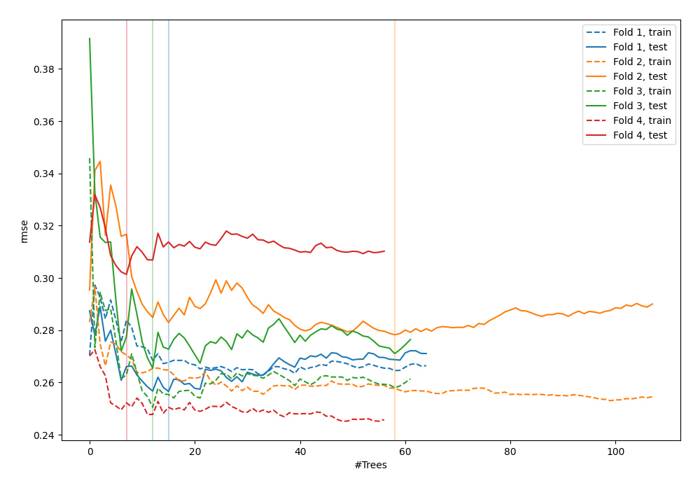
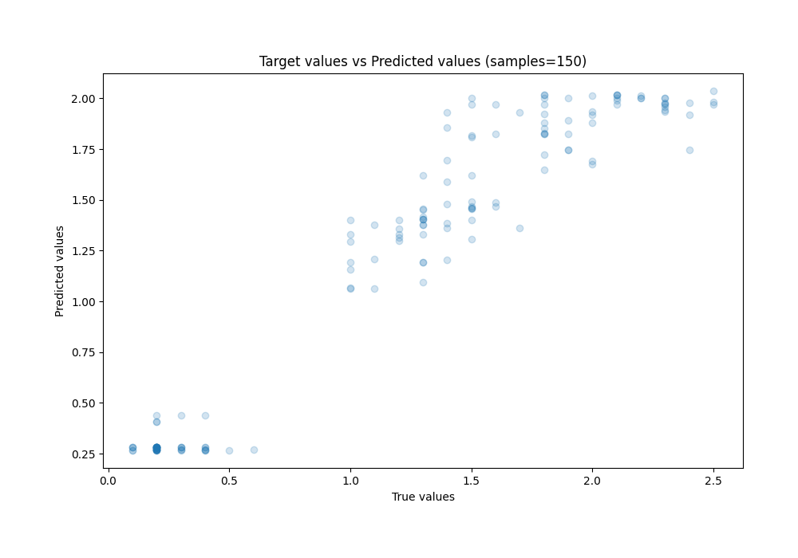
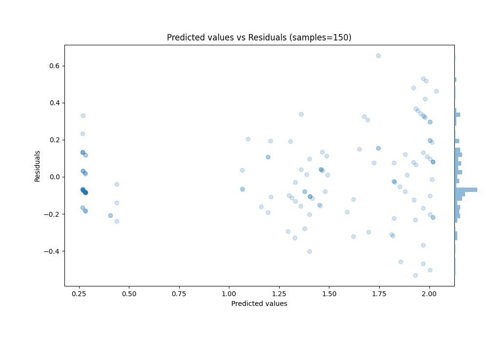

# Summary of 9_Default_RandomForest

[<< Go back](../README.md)

## Random Forest
- **n_jobs**: -1
- **criterion**: squared_error
- **max_features**: 0.9
- **min_samples_split**: 30
- **max_depth**: 4
- **eval_metric_name**: rmse
- **explain_level**: 0

## Validation
 - **validation_type**: kfold
 - **k_folds**: 4
 - **shuffle**: True
 - **random_seed**: 123

## Optimized metric
rmse

## Training time

1.9 seconds

### Metric details:
| Metric   |    Score |
|:---------|---------:|
| MAE      | 0.163396 |
| MSE      | 0.043833 |
| RMSE     | 0.209363 |
| R2       | 0.92405  |
| MAPE     | 0.251782 |

## Learning curves

## True vs Predicted

## Predicted vs Residuals

[<< Go back](../README.md)
