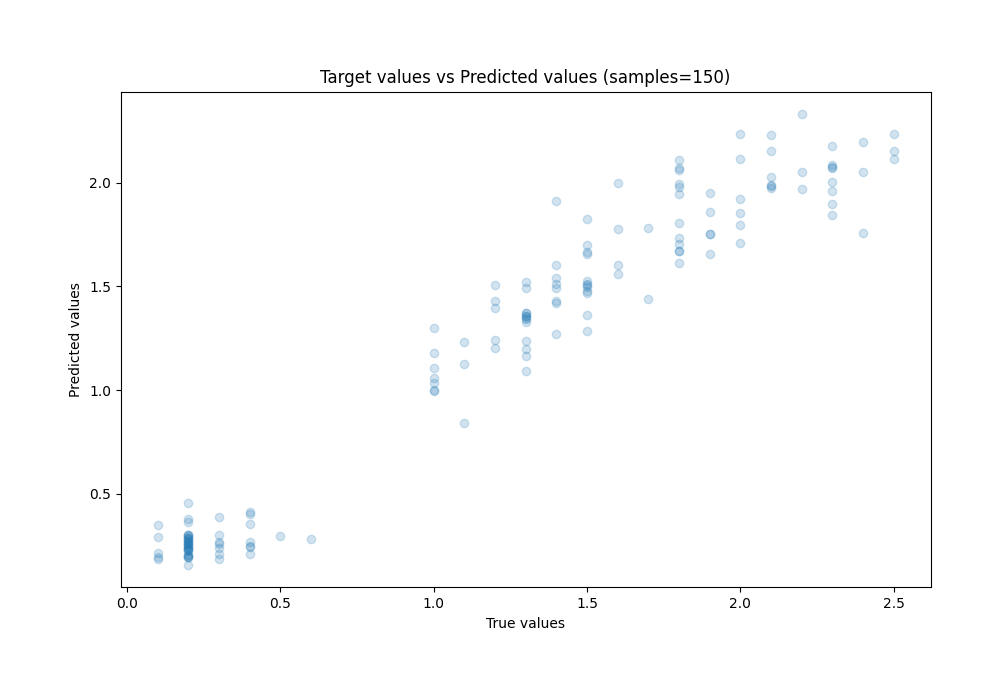

# Summary of Ensemble

[<< Go back](../README.md)

## Ensemble structure
| Model                  |   Weight |
|:-----------------------|---------:|
| 28_CatBoost            |        4 |
| 37_RandomForest        |        1 |
| 3_DecisionTree         |        1 |
| 4_Linear               |       10 |
| 64_NearestNeighbors    |        1 |
| 67_CatBoost            |        1 |
| 6_Default_Xgboost      |        3 |
| 9_Default_RandomForest |        1 |

### Metric details:
| Metric   |     Score |
|:---------|----------:|
| MAE      | 0.135455  |
| MSE      | 0.0311772 |
| RMSE     | 0.176571  |
| R2       | 0.945979  |
| MAPE     | 0.205366  |

## Learning curves

## True vs Predicted

## Predicted vs Residuals

[<< Go back](../README.md)
