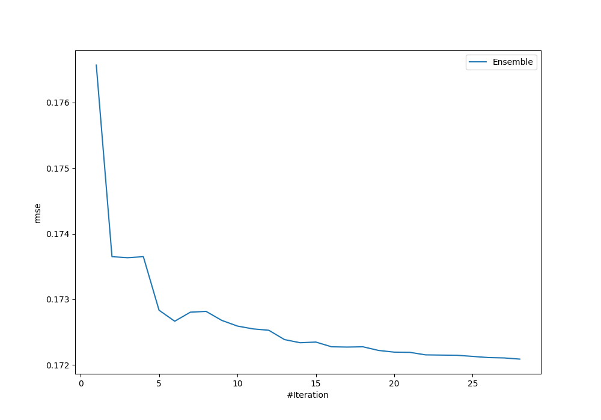
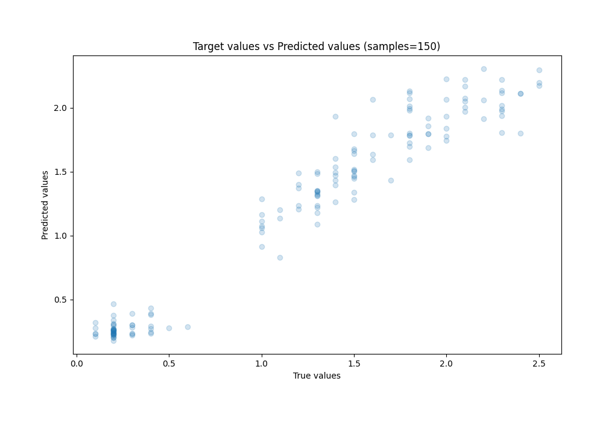
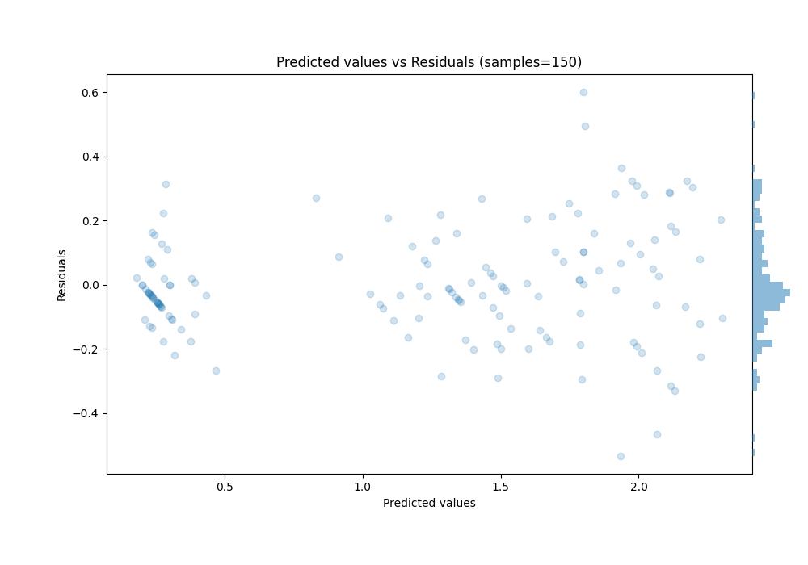

# Summary of Ensemble_Stacked

[<< Go back](../README.md)

## Ensemble structure
| Model               |   Weight |
|:--------------------|---------:|
| 37_RandomForest     |        1 |
| 4_Linear            |        8 |
| 64_NearestNeighbors |        2 |
| 67_CatBoost_Stacked |       14 |
| Ensemble            |        3 |

### Metric details:
| Metric   |     Score |
|:---------|----------:|
| MAE      | 0.128526  |
| MSE      | 0.0296145 |
| RMSE     | 0.172089  |
| R2       | 0.948687  |
| MAPE     | 0.196127  |

## Learning curves

## True vs Predicted

## Predicted vs Residuals

[<< Go back](../README.md)
