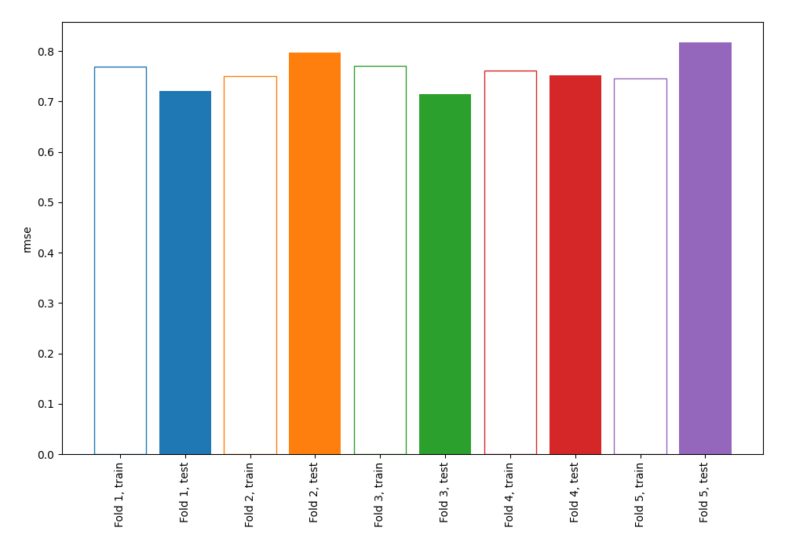
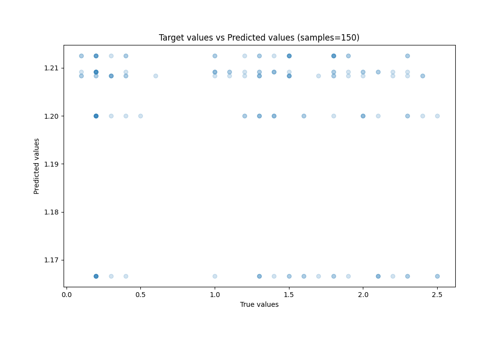
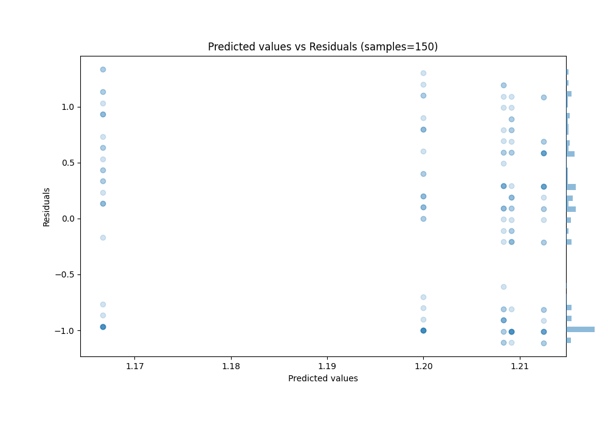

# Summary of 1_Baseline

[<< Go back](../README.md)

## Baseline Regressor (Baseline)
- **n_jobs**: -1
- **explain_level**: 1

## Validation
 - **validation_type**: kfold
 - **k_folds**: 5
 - **shuffle**: True

## Optimized metric
rmse

## Training time

1.1 seconds

### Metric details:
| Metric   |       Score |
|:---------|------------:|
| MAE      |  0.659778   |
| MSE      |  0.579686   |
| RMSE     |  0.761371   |
| R2       | -0.00442446 |
| MAPE     |  1.76395    |

## Learning curves

## True vs Predicted

## Predicted vs Residuals

[<< Go back](../README.md)
