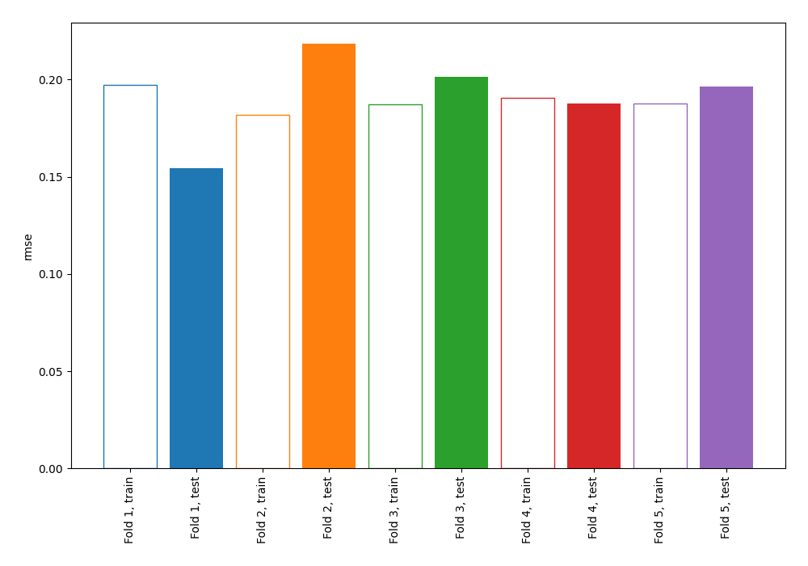
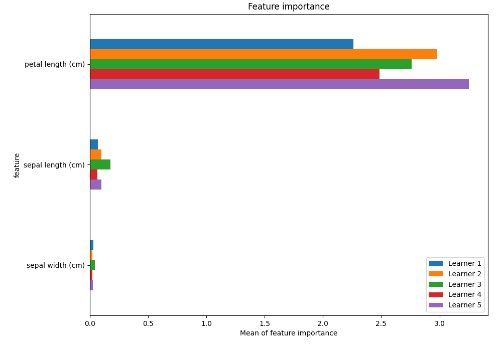
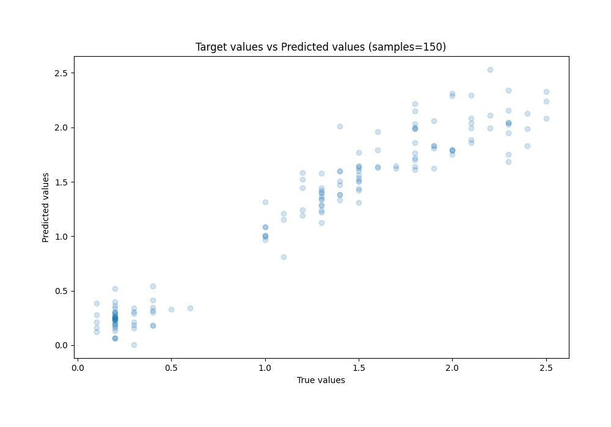
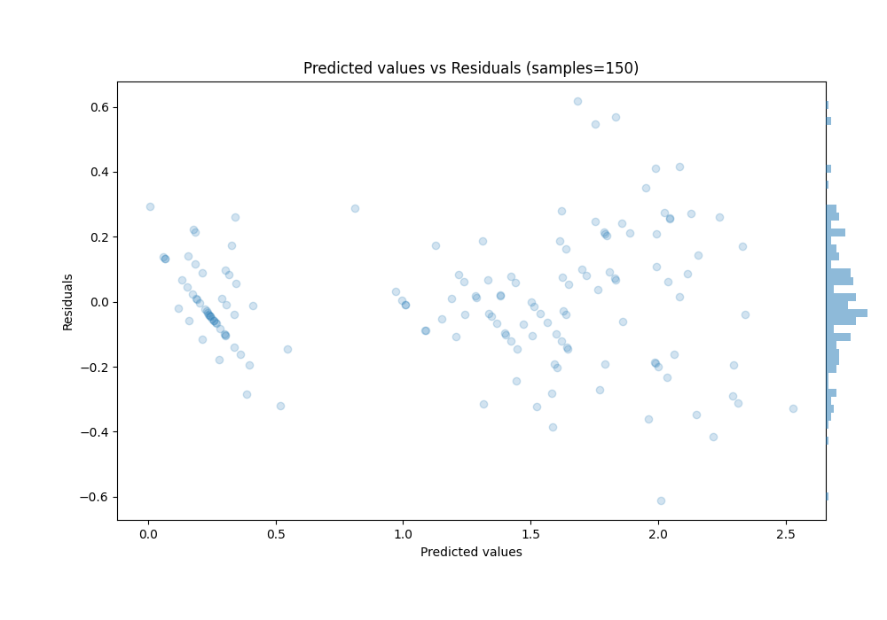

# Summary of 5_Linear

[<< Go back](../README.md)

## Linear Regression (Linear)
- **n_jobs**: -1
- **explain_level**: 1

## Validation
 - **validation_type**: kfold
 - **k_folds**: 5
 - **shuffle**: True

## Optimized metric
rmse

## Training time

1.4 seconds

### Metric details:
| Metric   |     Score |
|:---------|----------:|
| MAE      | 0.145364  |
| MSE      | 0.0371499 |
| RMSE     | 0.192743  |
| R2       | 0.93563   |
| MAPE     | 0.22148   |

## Learning curves

## Coefficients
| feature           |    Learner_1 |    Learner_2 |    Learner_3 |    Learner_4 |    Learner_5 |
|:------------------|-------------:|-------------:|-------------:|-------------:|-------------:|
| petal length (cm) |  1.19021     |  1.21912     |  1.22186     |  1.20369     |  1.22565     |
| sepal width (cm)  |  0.118653    |  0.120383    |  0.125056    |  0.133419    |  0.134488    |
| intercept         | -3.17002e-16 |  1.32523e-16 | -1.62511e-16 | -1.48735e-16 | -4.66496e-16 |
| sepal length (cm) | -0.205058    | -0.227396    | -0.235913    | -0.21082     | -0.239326    |

## Permutation-based Importance

## True vs Predicted

## Predicted vs Residuals

[<< Go back](../README.md)
