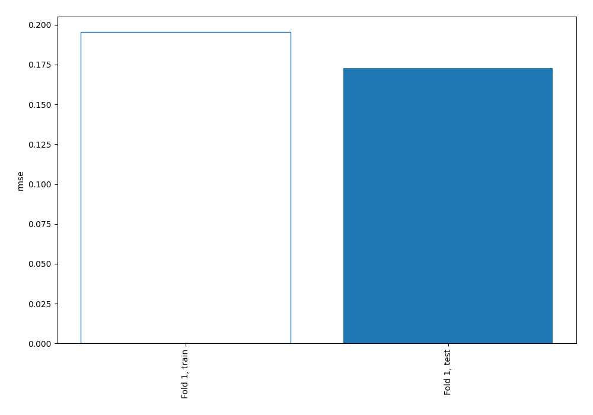
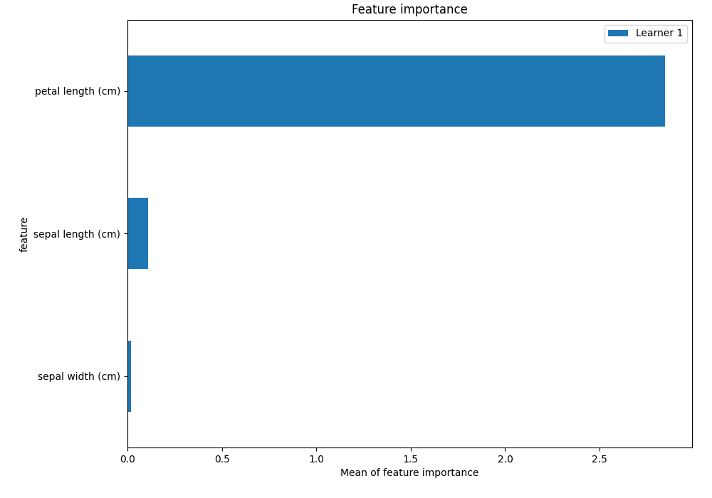
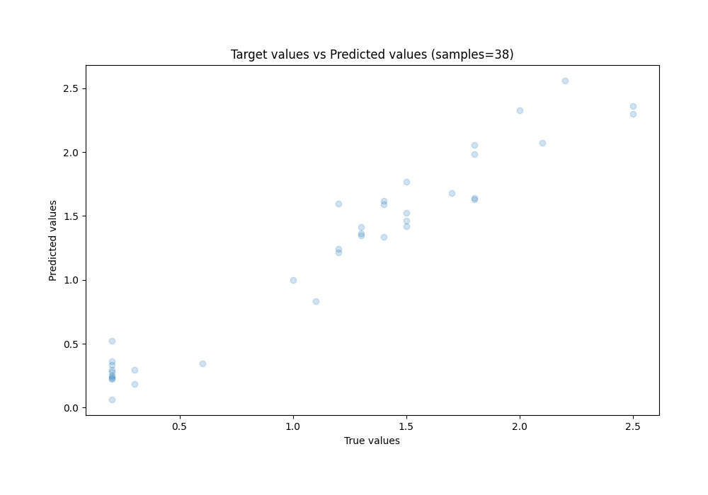
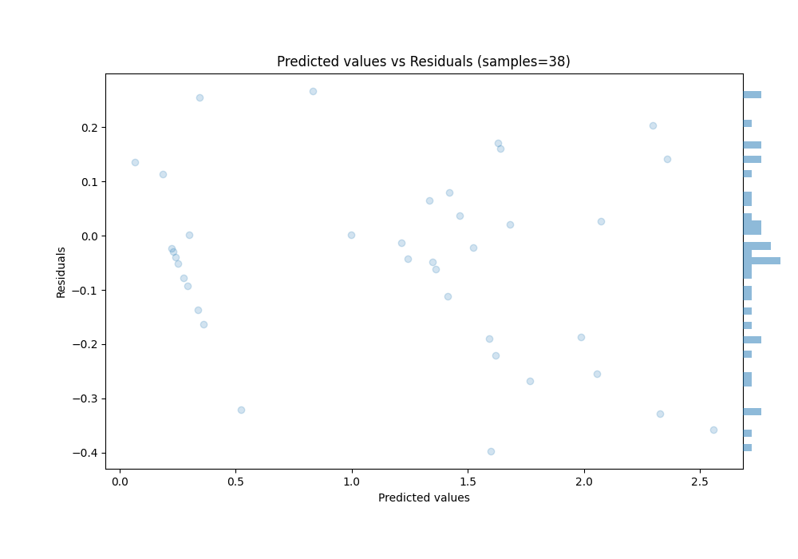
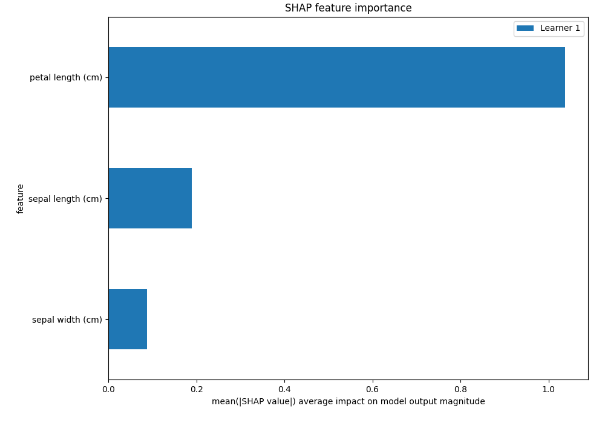
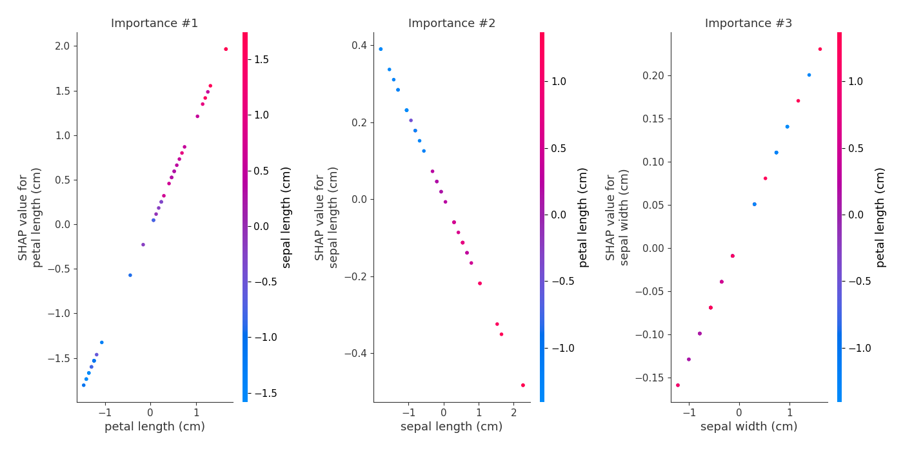
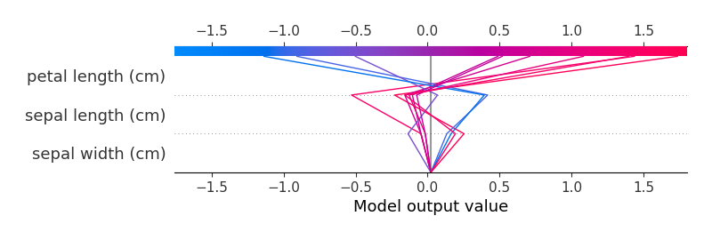
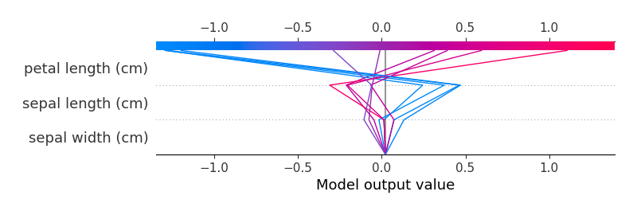

# Summary of 3_Linear

[<< Go back](../README.md)

## Linear Regression (Linear)
- **n_jobs**: -1
- **explain_level**: 2

## Validation
 - **validation_type**: split
 - **train_ratio**: 0.75
 - **shuffle**: True

## Optimized metric
rmse

## Training time

1.6 seconds

### Metric details:
| Metric   |     Score |
|:---------|----------:|
| MAE      | 0.13463   |
| MSE      | 0.0298809 |
| RMSE     | 0.172861  |
| R2       | 0.942965  |
| MAPE     | 0.223254  |

## Learning curves

## Coefficients
| feature           |    Learner_1 |
|:------------------|-------------:|
| petal length (cm) |  1.20707     |
| sepal width (cm)  |  0.137874    |
| intercept         | -1.02608e-16 |
| sepal length (cm) | -0.215231    |

## Permutation-based Importance

## True vs Predicted

## Predicted vs Residuals

## SHAP Importance

## SHAP Dependence plots

### Dependence (Fold 1)

## SHAP Decision plots

### Top-10 Worst decisions (Fold 1)

### Top-10 Best decisions (Fold 1)

[<< Go back](../README.md)
