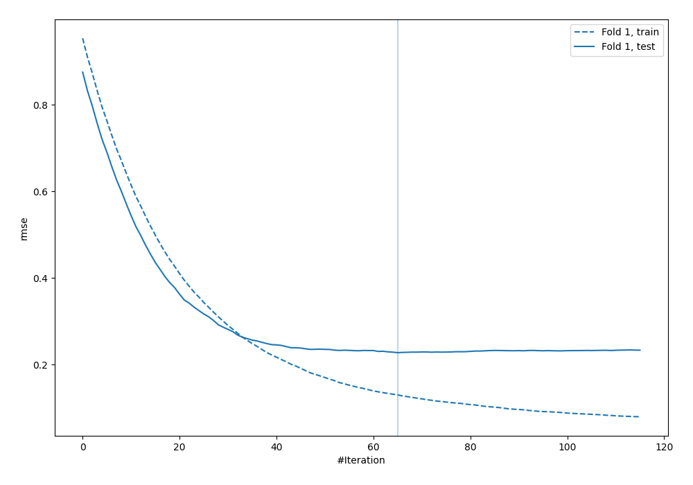
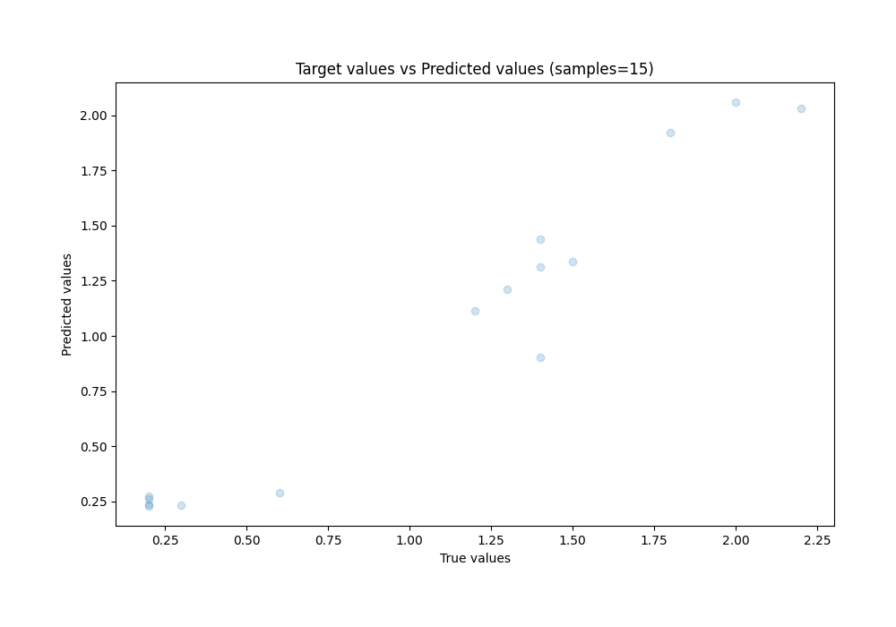
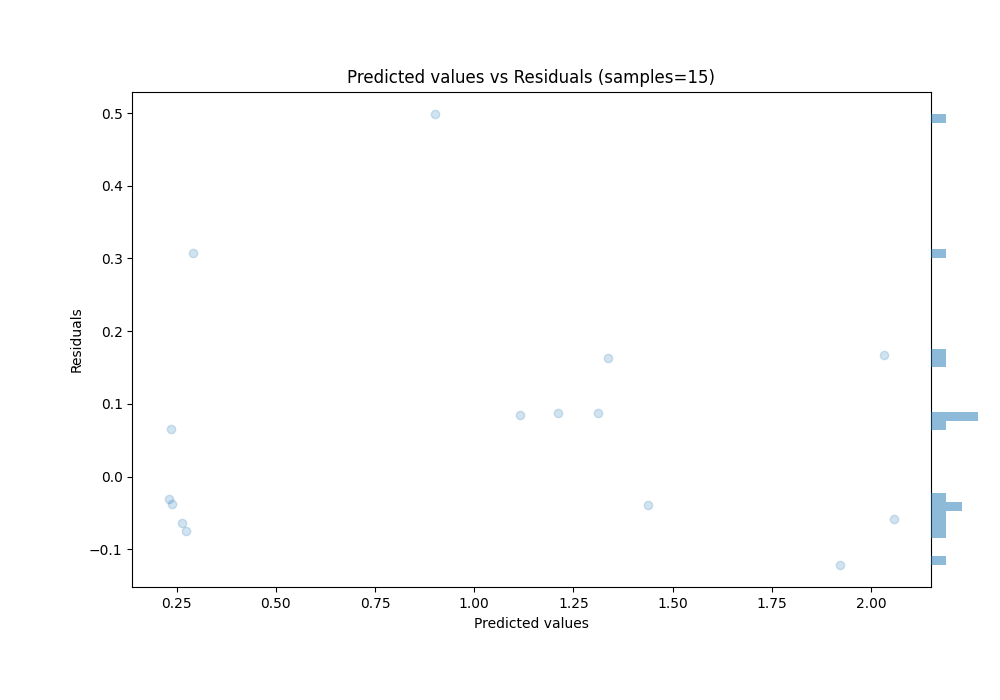

# Summary of 17_Xgboost

[<< Go back](../README.md)

## Extreme Gradient Boosting (Xgboost)
- **n_jobs**: -1
- **objective**: reg:squarederror
- **eta**: 0.05
- **max_depth**: 7
- **min_child_weight**: 1
- **subsample**: 0.9
- **colsample_bytree**: 0.9
- **eval_metric**: rmse
- **explain_level**: 0

## Validation
 - **validation_type**: split
 - **train_ratio**: 0.9
 - **shuffle**: True

## Optimized metric
rmse

## Training time

0.5 seconds

### Metric details:
| Metric   |     Score |
|:---------|----------:|
| MAE      | 0.125691  |
| MSE      | 0.0303938 |
| RMSE     | 0.174338  |
| R2       | 0.935752  |
| MAPE     | 0.174874  |

## Learning curves

## True vs Predicted

## Predicted vs Residuals

[<< Go back](../README.md)
