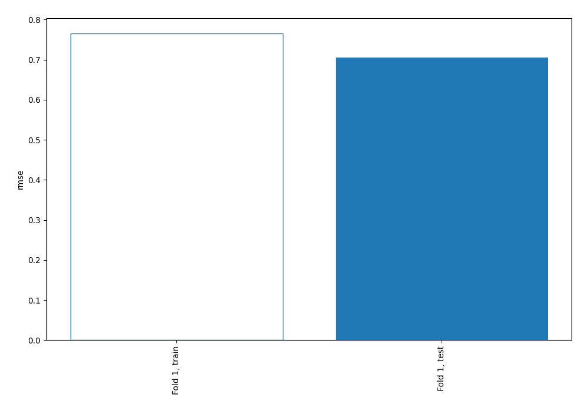
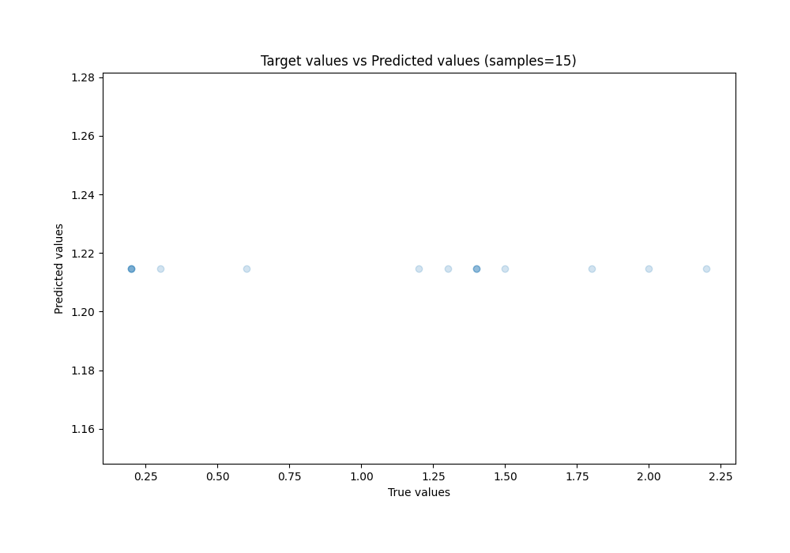
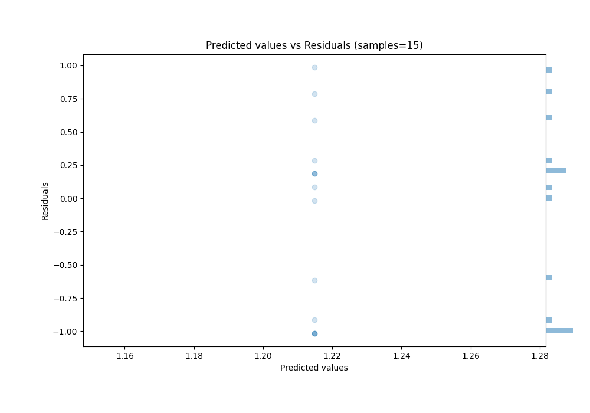

# Summary of 2_Baseline

[<< Go back](../README.md)

## Baseline Regressor (Baseline)
- **n_jobs**: -1
- **explain_level**: 0

## Validation
 - **validation_type**: split
 - **train_ratio**: 0.9
 - **shuffle**: True

## Optimized metric
rmse

## Training time

0.3 seconds

### Metric details:
| Metric   |      Score |
|:---------|-----------:|
| MAE      |  0.592346  |
| MSE      |  0.497034  |
| RMSE     |  0.705007  |
| R2       | -0.0506644 |
| MAPE     |  1.74671   |

## Learning curves

## True vs Predicted

## Predicted vs Residuals

[<< Go back](../README.md)
