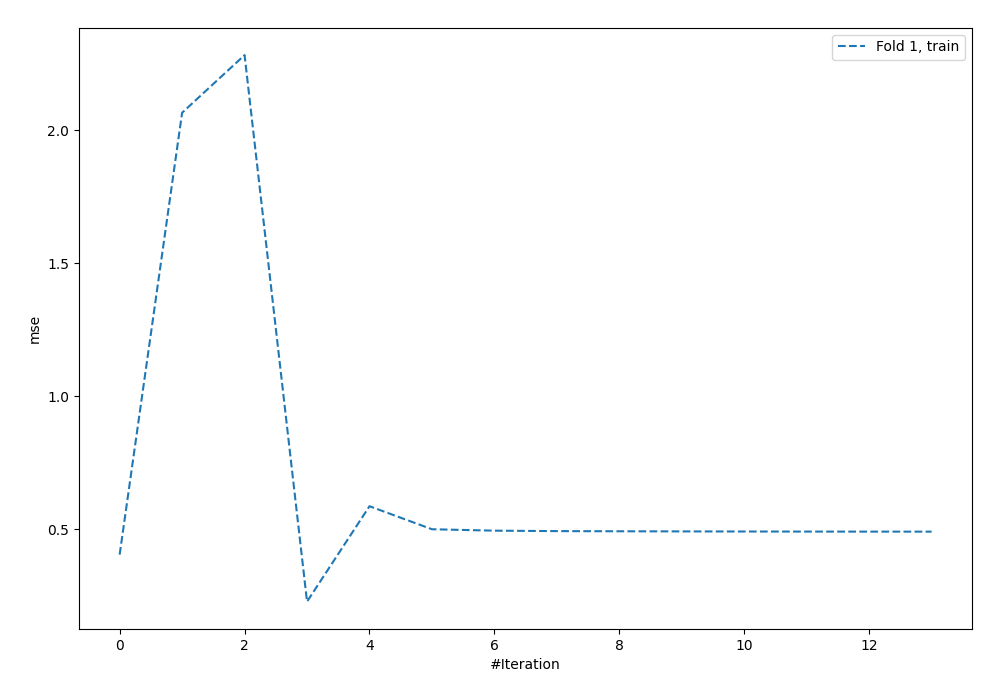
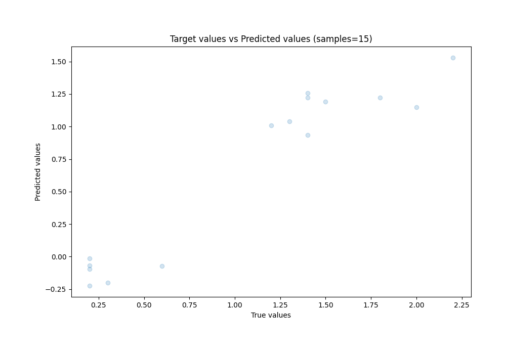
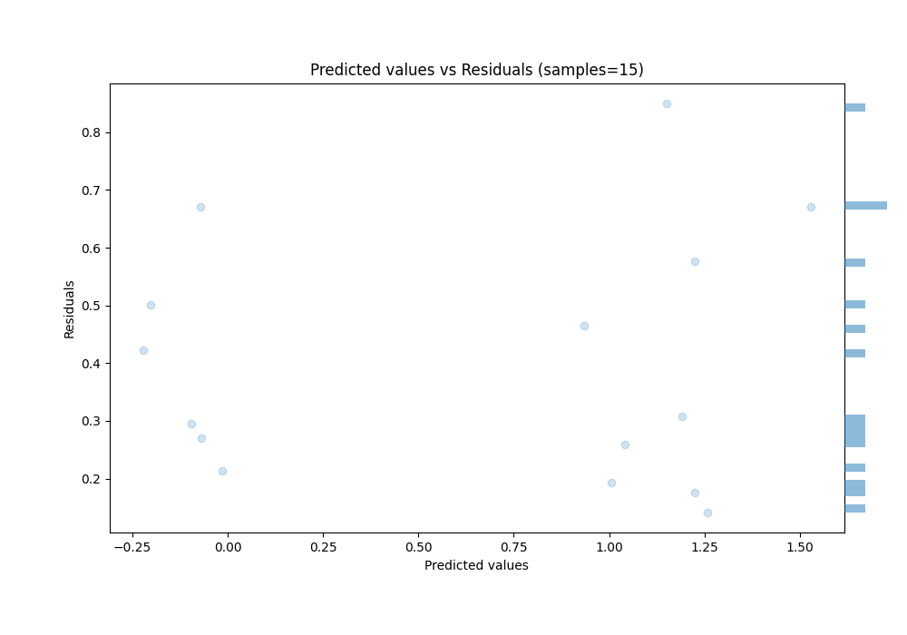

# Summary of 34_NeuralNetwork

[<< Go back](../README.md)

## Neural Network
- **n_jobs**: -1
- **dense_1_size**: 64
- **dense_2_size**: 8
- **learning_rate**: 0.1
- **explain_level**: 0

## Validation
 - **validation_type**: split
 - **train_ratio**: 0.9
 - **shuffle**: True

## Optimized metric
rmse

## Training time

0.4 seconds

### Metric details:
| Metric   |    Score |
|:---------|---------:|
| MAE      | 0.400978 |
| MSE      | 0.203818 |
| RMSE     | 0.451462 |
| R2       | 0.569155 |
| MAPE     | 0.731695 |

## Learning curves

## True vs Predicted

## Predicted vs Residuals

[<< Go back](../README.md)
