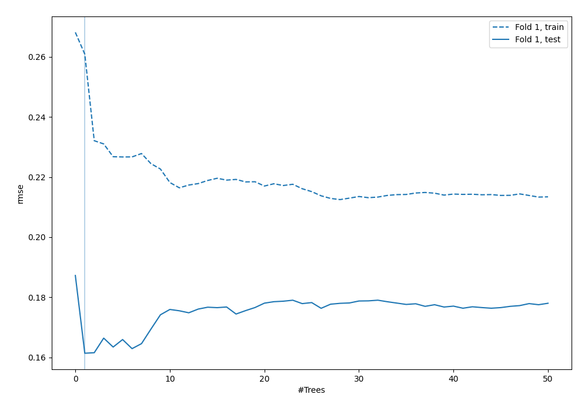
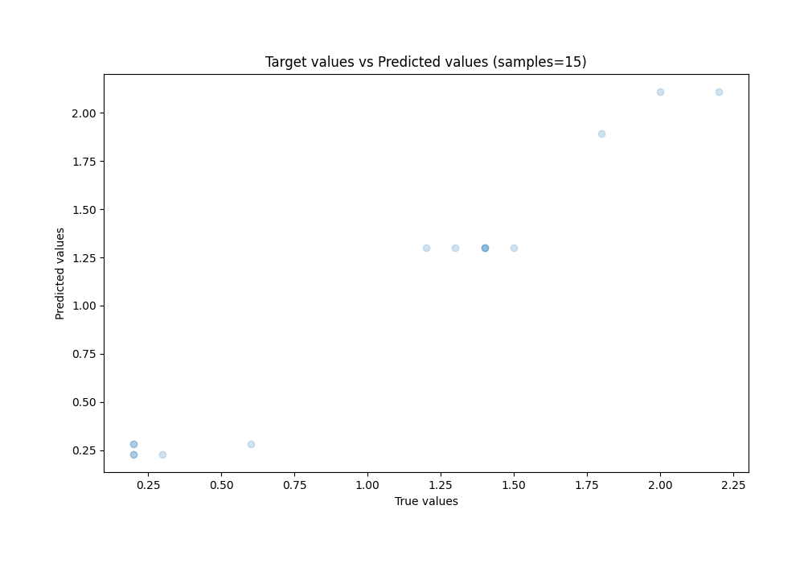
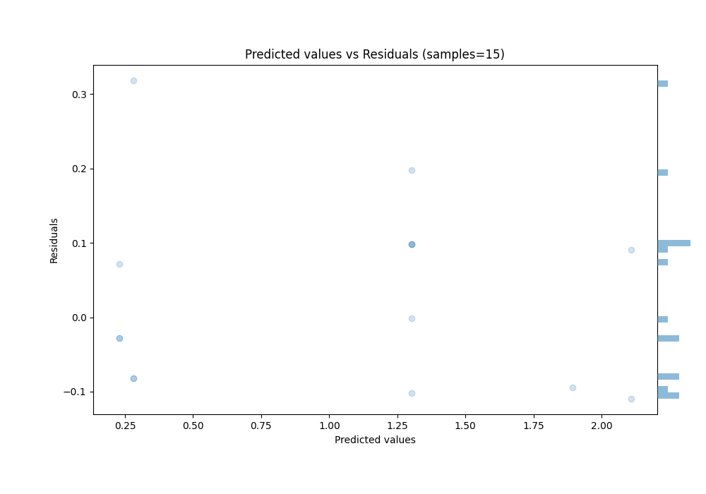

# Summary of 8_Default_RandomForest_GoldenFeatures

[<< Go back](../README.md)

## Random Forest
- **n_jobs**: -1
- **criterion**: squared_error
- **max_features**: 0.9
- **min_samples_split**: 30
- **max_depth**: 4
- **eval_metric_name**: rmse
- **explain_level**: 0

## Validation
 - **validation_type**: split
 - **train_ratio**: 0.9
 - **shuffle**: True

## Optimized metric
rmse

## Training time

7.4 seconds

### Metric details:
| Metric   |     Score |
|:---------|----------:|
| MAE      | 0.10005   |
| MSE      | 0.0152685 |
| RMSE     | 0.123566  |
| R2       | 0.967724  |
| MAPE     | 0.163106  |

## Learning curves

## True vs Predicted

## Predicted vs Residuals

[<< Go back](../README.md)
