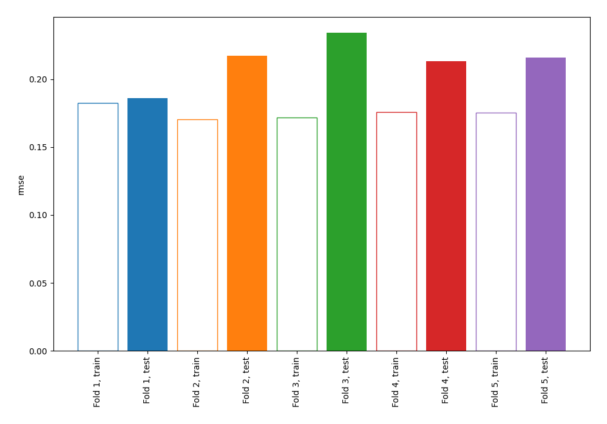
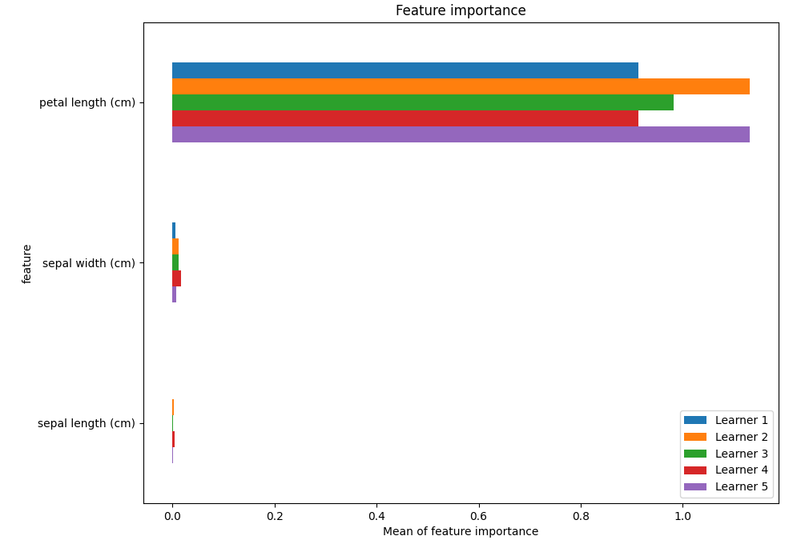
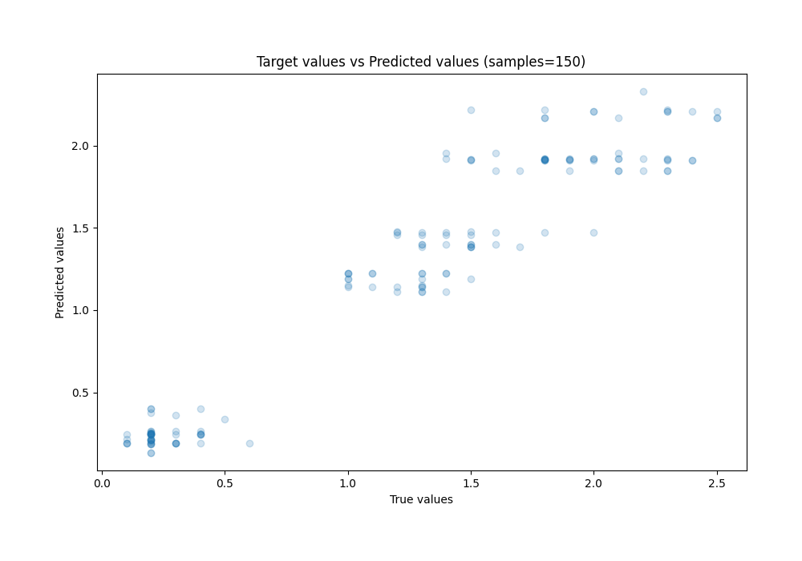
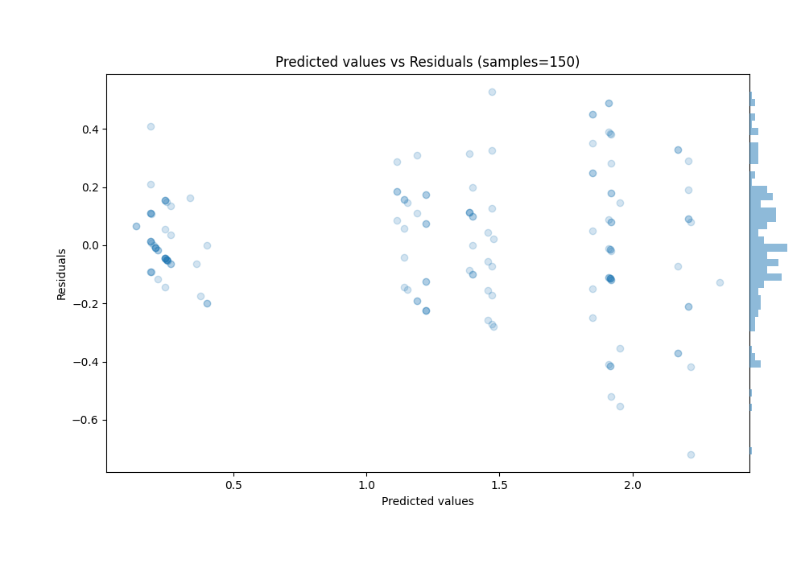

# Summary of 2_DecisionTree

[<< Go back](../README.md)

## Decision Tree
- **n_jobs**: -1
- **criterion**: squared_error
- **max_depth**: 3
- **explain_level**: 1

## Validation
 - **validation_type**: kfold
 - **k_folds**: 5
 - **shuffle**: True

## Optimized metric
rmse

## Training time

29.5 seconds

### Metric details:
| Metric   |     Score |
|:---------|----------:|
| MAE      | 0.163568  |
| MSE      | 0.0457072 |
| RMSE     | 0.213792  |
| R2       | 0.920803  |
| MAPE     | 0.203993  |

## Learning curves

## Permutation-based Importance

## True vs Predicted

## Predicted vs Residuals

[<< Go back](../README.md)
