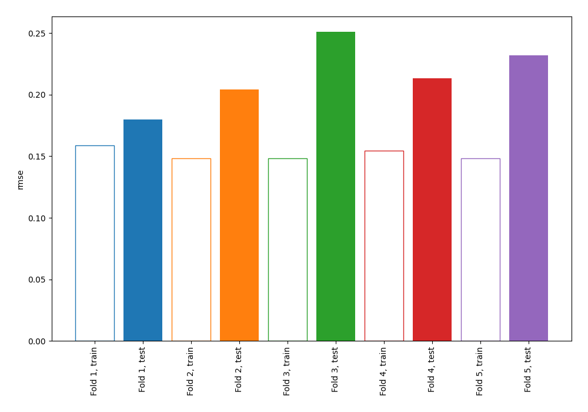
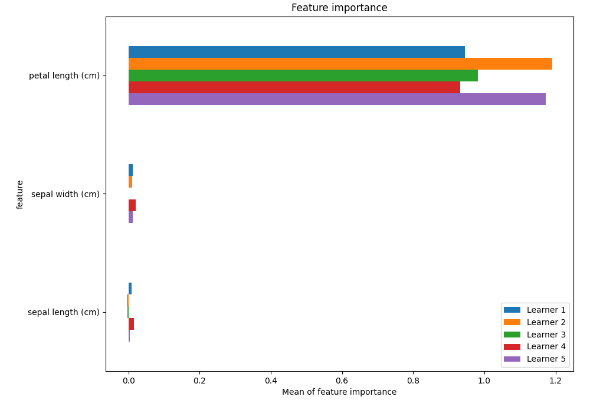
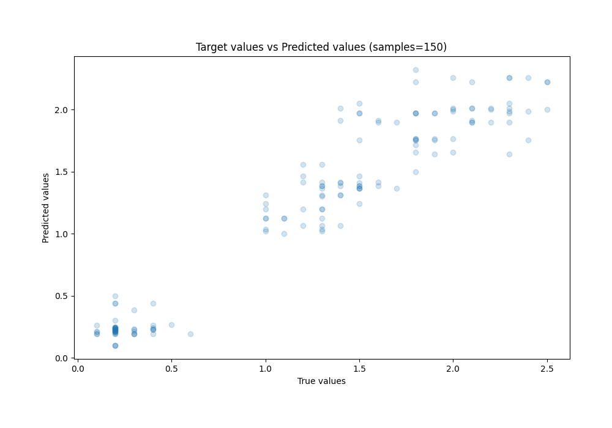
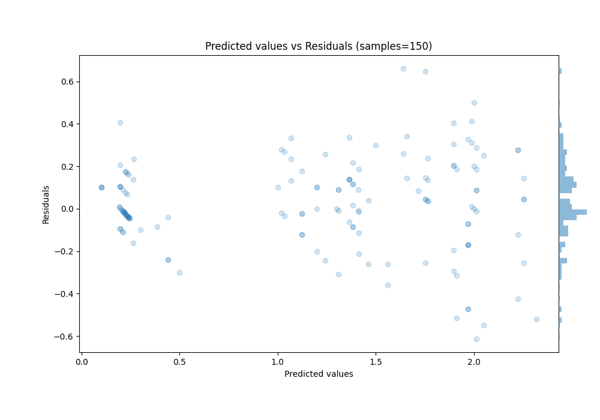

# Summary of 4_DecisionTree

[<< Go back](../README.md)

## Decision Tree
- **n_jobs**: -1
- **criterion**: squared_error
- **max_depth**: 4
- **explain_level**: 1

## Validation
 - **validation_type**: kfold
 - **k_folds**: 5
 - **shuffle**: True

## Optimized metric
rmse

## Training time

20.5 seconds

### Metric details:
| Metric   |    Score |
|:---------|---------:|
| MAE      | 0.16276  |
| MSE      | 0.047287 |
| RMSE     | 0.217456 |
| R2       | 0.918066 |
| MAPE     | 0.2147   |

## Learning curves

## Permutation-based Importance

## True vs Predicted

## Predicted vs Residuals

[<< Go back](../README.md)
