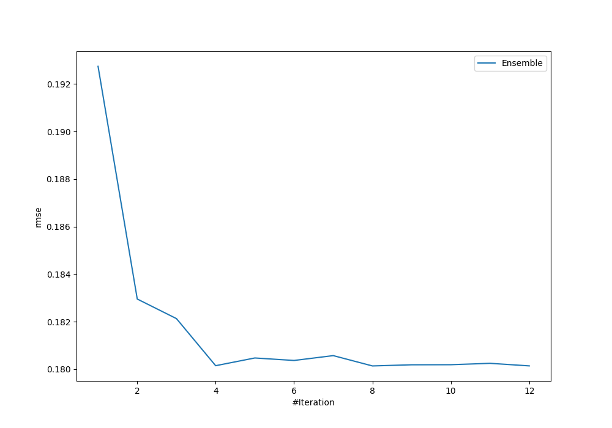
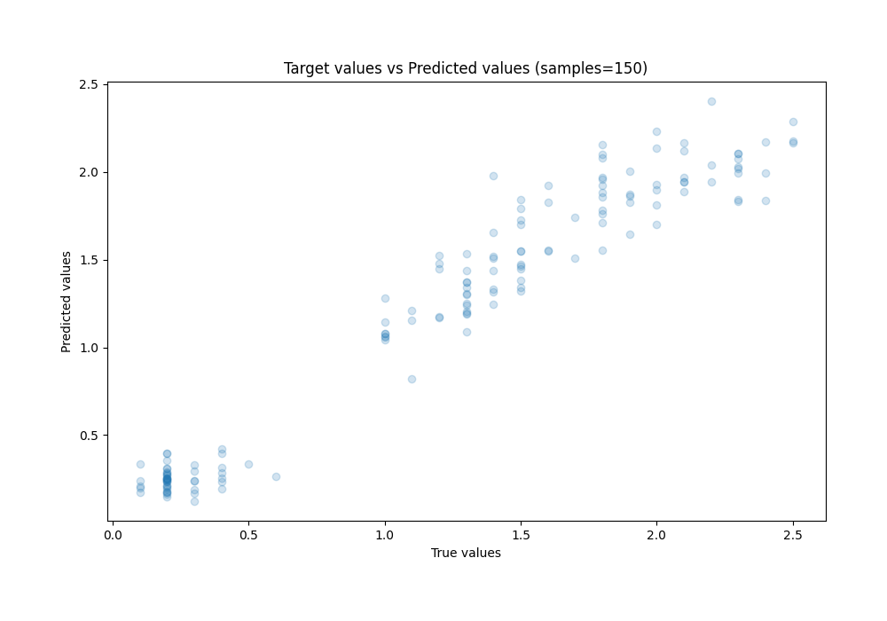

# Summary of Ensemble

[<< Go back](../README.md)

## Ensemble structure
| Model          |   Weight |
|:---------------|---------:|
| 11_Xgboost     |        1 |
| 2_DecisionTree |        2 |
| 5_Linear       |        4 |
| 6_Xgboost      |        1 |

### Metric details:
| Metric   |     Score |
|:---------|----------:|
| MAE      | 0.139354  |
| MSE      | 0.0324495 |
| RMSE     | 0.180138  |
| R2       | 0.943775  |
| MAPE     | 0.201847  |

## Learning curves

## True vs Predicted

## Predicted vs Residuals

[<< Go back](../README.md)
