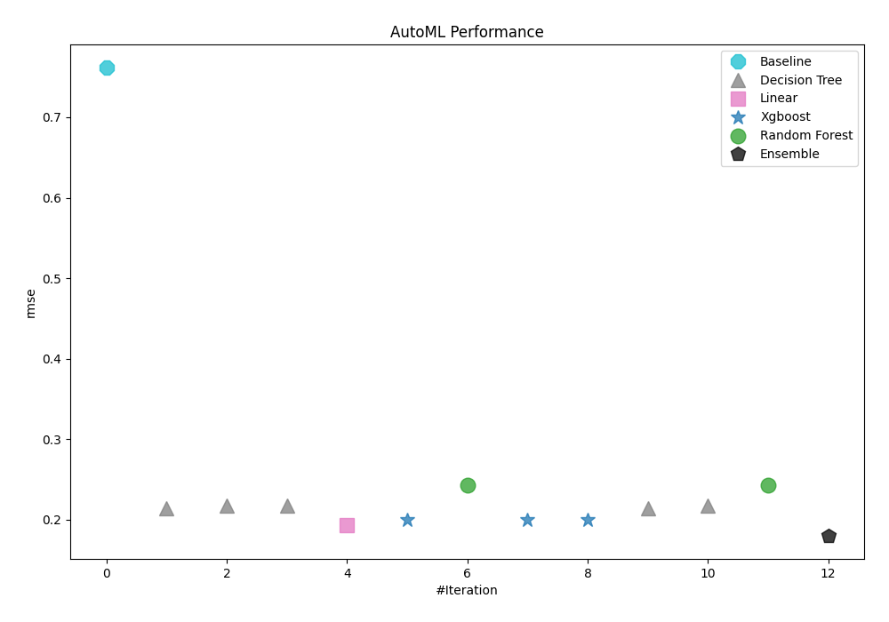
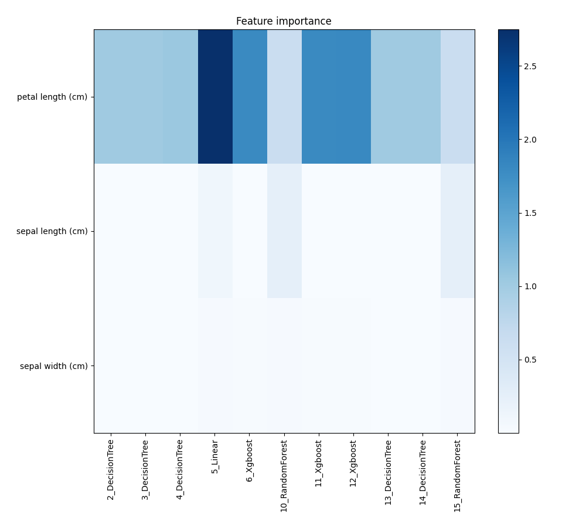
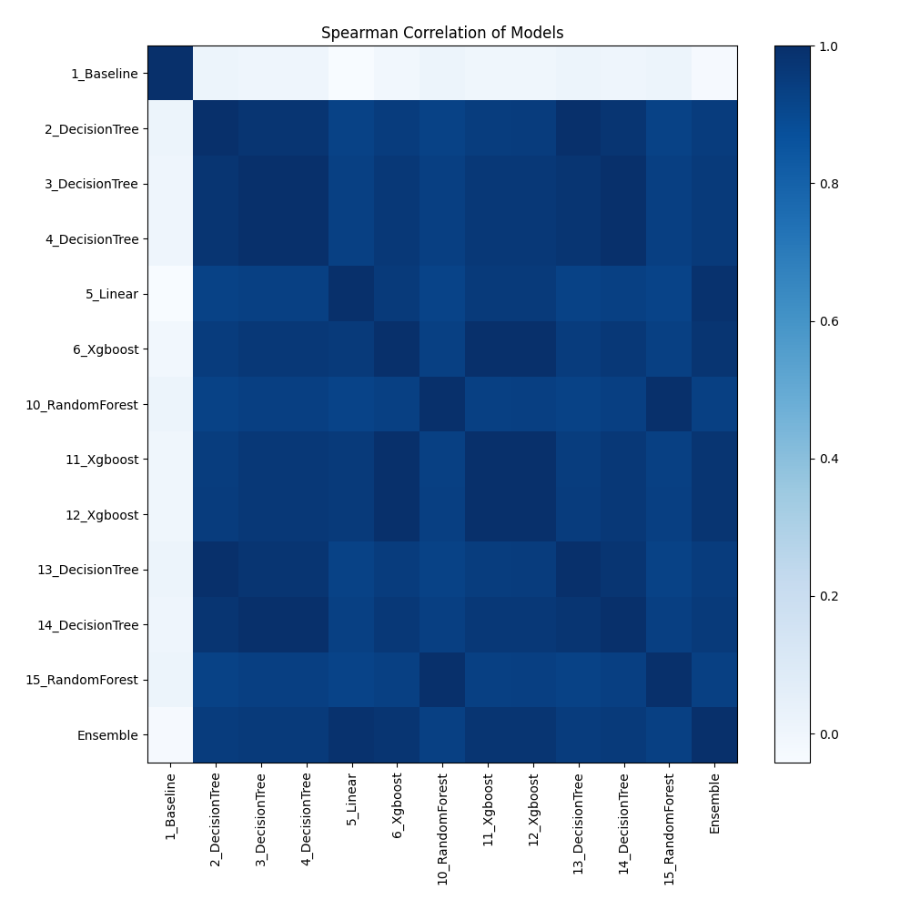

# AutoML Leaderboard

| Best model   | name                                         | model_type    | metric_type   |   metric_value |   train_time |   single_prediction_time |
|:-------------|:---------------------------------------------|:--------------|:--------------|---------------:|-------------:|-------------------------:|
|              | [1_Baseline](1_Baseline/README.md)           | Baseline      | rmse          |       0.761371 |         1.8  |                   0.029  |
|              | [2_DecisionTree](2_DecisionTree/README.md)   | Decision Tree | rmse          |       0.213792 |        30.15 |                   0.018  |
|              | [3_DecisionTree](3_DecisionTree/README.md)   | Decision Tree | rmse          |       0.217303 |        14.05 |                   0.0275 |
|              | [4_DecisionTree](4_DecisionTree/README.md)   | Decision Tree | rmse          |       0.217456 |        21.24 |                   0.023  |
|              | [5_Linear](5_Linear/README.md)               | Linear        | rmse          |       0.192743 |         2.1  |                   0.047  |
|              | [6_Xgboost](6_Xgboost/README.md)             | Xgboost       | rmse          |       0.199145 |         5.3  |                   0.061  |
|              | [10_RandomForest](10_RandomForest/README.md) | Random Forest | rmse          |       0.242623 |         6.2  |                   0.146  |
|              | [11_Xgboost](11_Xgboost/README.md)           | Xgboost       | rmse          |       0.199233 |         2.56 |                   0.049  |
|              | [12_Xgboost](12_Xgboost/README.md)           | Xgboost       | rmse          |       0.199155 |         2.87 |                   0.0515 |
|              | [13_DecisionTree](13_DecisionTree/README.md) | Decision Tree | rmse          |       0.213792 |         7.88 |                   0.0165 |
|              | [14_DecisionTree](14_DecisionTree/README.md) | Decision Tree | rmse          |       0.217188 |        11.72 |                   0.0206 |
|              | [15_RandomForest](15_RandomForest/README.md) | Random Forest | rmse          |       0.242623 |         5.25 |                   0.1442 |
| **the best** | [Ensemble](Ensemble/README.md)               | Ensemble      | rmse          |       0.180138 |         0.41 |                   0.1735 |

### AutoML Performance

### AutoML Performance Boxplot

### Features Importance

### Spearman Correlation of Models

