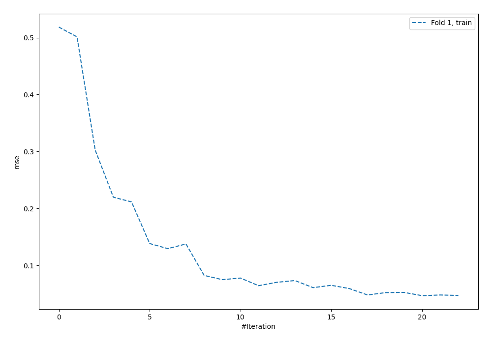
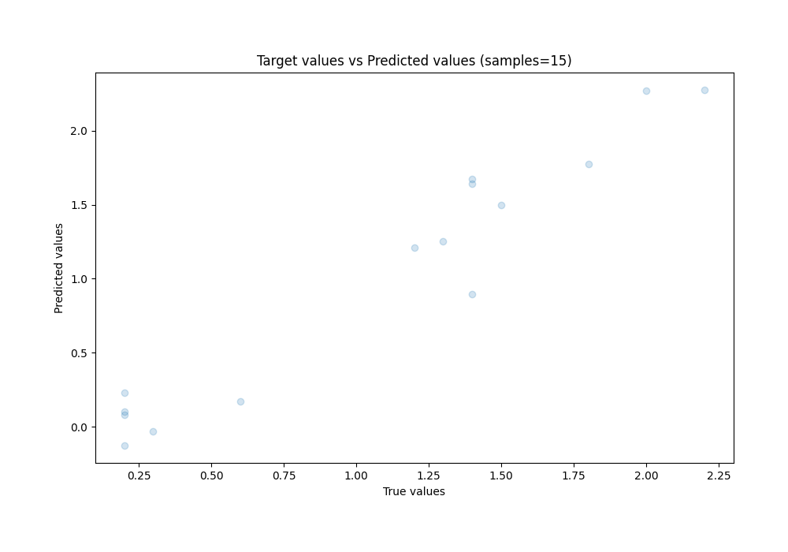
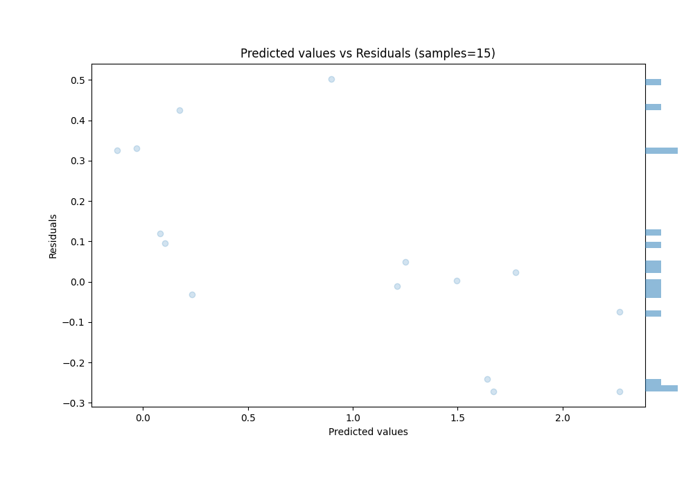

# Summary of 35_NeuralNetwork

[<< Go back](../README.md)

## Neural Network
- **n_jobs**: -1
- **dense_1_size**: 16
- **dense_2_size**: 32
- **learning_rate**: 0.08
- **explain_level**: 0

## Validation
 - **validation_type**: split
 - **train_ratio**: 0.9
 - **shuffle**: True

## Optimized metric
rmse

## Training time

0.4 seconds

### Metric details:
| Metric   |     Score |
|:---------|----------:|
| MAE      | 0.18495   |
| MSE      | 0.0591081 |
| RMSE     | 0.243122  |
| R2       | 0.875053  |
| MAPE     | 0.375463  |

## Learning curves

## True vs Predicted

## Predicted vs Residuals

[<< Go back](../README.md)
