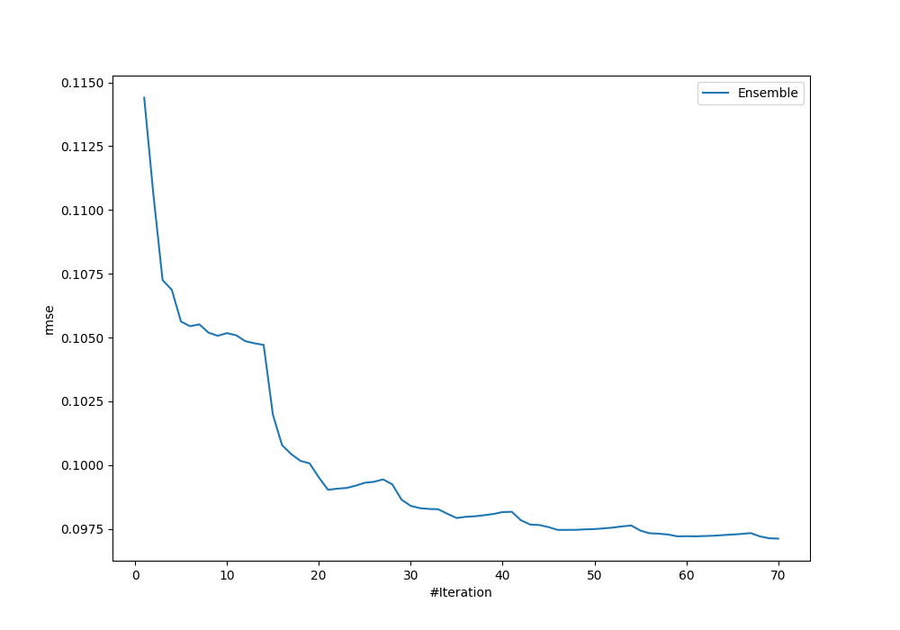
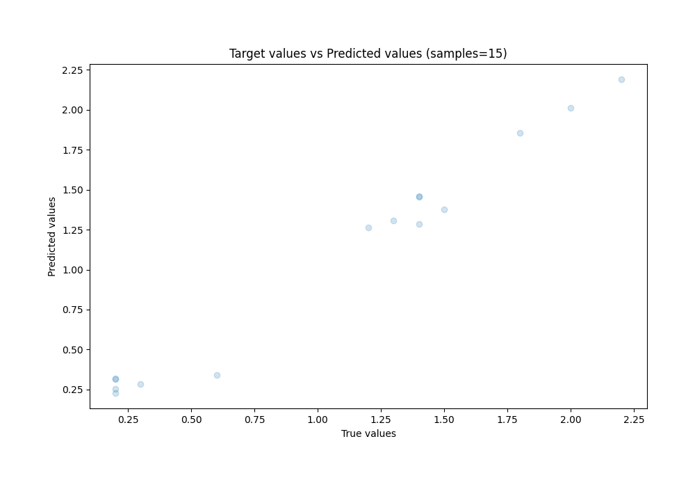
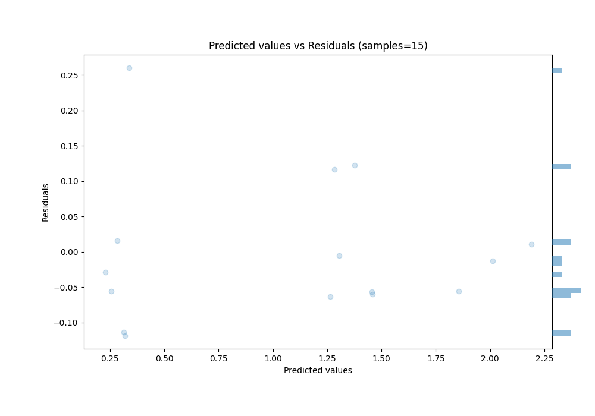

# Summary of Ensemble

[<< Go back](../README.md)

## Ensemble structure
| Model                                 |   Weight |
|:--------------------------------------|---------:|
| 12_Xgboost                            |        5 |
| 18_RandomForest                       |       10 |
| 25_RandomForest                       |        6 |
| 26_RandomForest                       |        2 |
| 34_NeuralNetwork                      |        4 |
| 37_RandomForest                       |        3 |
| 43_Xgboost                            |        1 |
| 51_DecisionTree                       |        6 |
| 5_Linear                              |       24 |
| 61_NeuralNetwork                      |        4 |
| 7_Default_NeuralNetwork               |        1 |
| 8_Default_RandomForest_GoldenFeatures |        4 |

### Metric details:
| Metric   |      Score |
|:---------|-----------:|
| MAE      | 0.0729458  |
| MSE      | 0.00943209 |
| RMSE     | 0.0971189  |
| R2       | 0.980062   |
| MAPE     | 0.160801   |

## Learning curves

## True vs Predicted

## Predicted vs Residuals

[<< Go back](../README.md)
