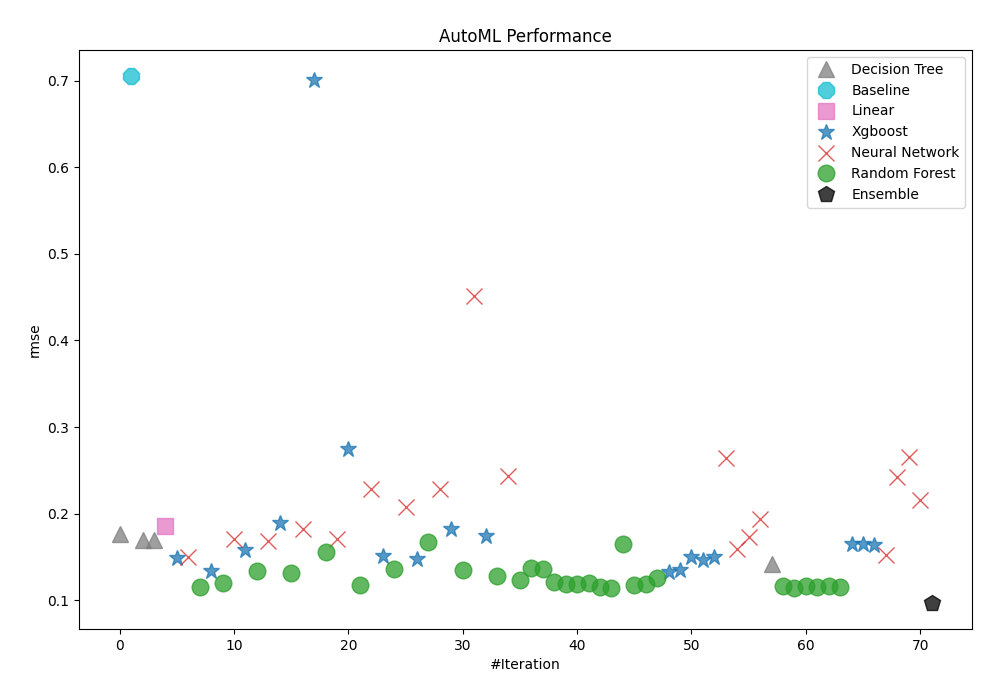
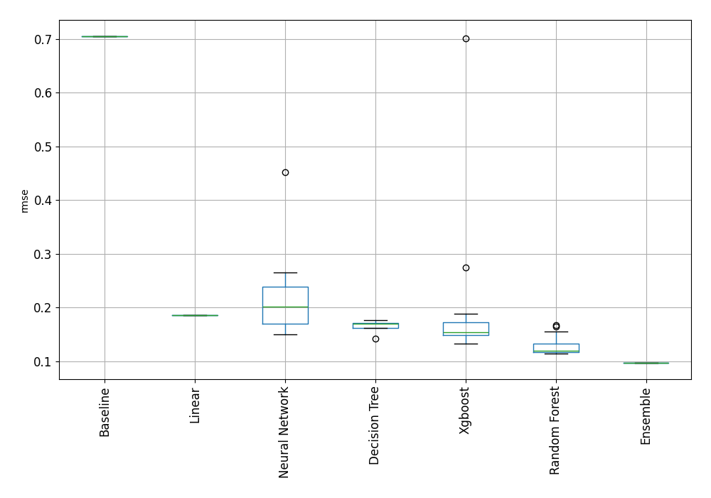
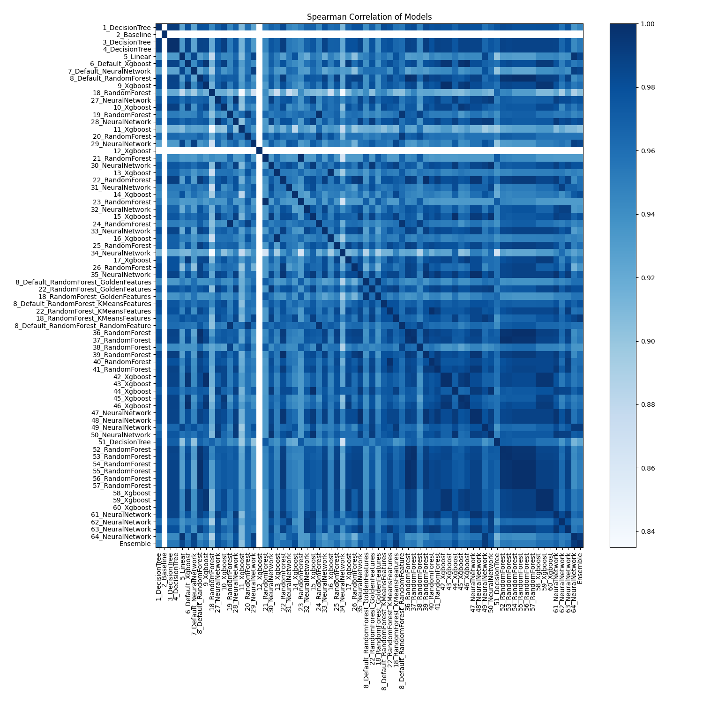

# AutoML Leaderboard

| Best model   | name                                                                                     | model_type     | metric_type   |   metric_value |   train_time |
|:-------------|:-----------------------------------------------------------------------------------------|:---------------|:--------------|---------------:|-------------:|
|              | [1_DecisionTree](1_DecisionTree/README.md)                                               | Decision Tree  | rmse          |      0.17655   |         0.68 |
|              | [2_Baseline](2_Baseline/README.md)                                                       | Baseline       | rmse          |      0.705007  |         0.69 |
|              | [3_DecisionTree](3_DecisionTree/README.md)                                               | Decision Tree  | rmse          |      0.169124  |         0.66 |
|              | [4_DecisionTree](4_DecisionTree/README.md)                                               | Decision Tree  | rmse          |      0.169124  |         0.65 |
|              | [5_Linear](5_Linear/README.md)                                                           | Linear         | rmse          |      0.185766  |         0.67 |
|              | [6_Default_Xgboost](6_Default_Xgboost/README.md)                                         | Xgboost        | rmse          |      0.148858  |         0.79 |
|              | [7_Default_NeuralNetwork](7_Default_NeuralNetwork/README.md)                             | Neural Network | rmse          |      0.149428  |         0.77 |
|              | [8_Default_RandomForest](8_Default_RandomForest/README.md)                               | Random Forest  | rmse          |      0.115134  |         1.06 |
|              | [9_Xgboost](9_Xgboost/README.md)                                                         | Xgboost        | rmse          |      0.133685  |         0.85 |
|              | [18_RandomForest](18_RandomForest/README.md)                                             | Random Forest  | rmse          |      0.120136  |         1.03 |
|              | [27_NeuralNetwork](27_NeuralNetwork/README.md)                                           | Neural Network | rmse          |      0.170187  |         0.79 |
|              | [10_Xgboost](10_Xgboost/README.md)                                                       | Xgboost        | rmse          |      0.157346  |         0.79 |
|              | [19_RandomForest](19_RandomForest/README.md)                                             | Random Forest  | rmse          |      0.133101  |         1.19 |
|              | [28_NeuralNetwork](28_NeuralNetwork/README.md)                                           | Neural Network | rmse          |      0.168559  |         0.77 |
|              | [11_Xgboost](11_Xgboost/README.md)                                                       | Xgboost        | rmse          |      0.188765  |         0.86 |
|              | [20_RandomForest](20_RandomForest/README.md)                                             | Random Forest  | rmse          |      0.131749  |         1.13 |
|              | [29_NeuralNetwork](29_NeuralNetwork/README.md)                                           | Neural Network | rmse          |      0.182241  |         0.75 |
|              | [12_Xgboost](12_Xgboost/README.md)                                                       | Xgboost        | rmse          |      0.700421  |         0.78 |
|              | [21_RandomForest](21_RandomForest/README.md)                                             | Random Forest  | rmse          |      0.155729  |         1.05 |
|              | [30_NeuralNetwork](30_NeuralNetwork/README.md)                                           | Neural Network | rmse          |      0.170635  |         0.73 |
|              | [13_Xgboost](13_Xgboost/README.md)                                                       | Xgboost        | rmse          |      0.274347  |         0.9  |
|              | [22_RandomForest](22_RandomForest/README.md)                                             | Random Forest  | rmse          |      0.117702  |         1.03 |
|              | [31_NeuralNetwork](31_NeuralNetwork/README.md)                                           | Neural Network | rmse          |      0.228088  |         0.73 |
|              | [14_Xgboost](14_Xgboost/README.md)                                                       | Xgboost        | rmse          |      0.150953  |         0.8  |
|              | [23_RandomForest](23_RandomForest/README.md)                                             | Random Forest  | rmse          |      0.135651  |         1.1  |
|              | [32_NeuralNetwork](32_NeuralNetwork/README.md)                                           | Neural Network | rmse          |      0.207833  |         0.75 |
|              | [15_Xgboost](15_Xgboost/README.md)                                                       | Xgboost        | rmse          |      0.148054  |         0.82 |
|              | [24_RandomForest](24_RandomForest/README.md)                                             | Random Forest  | rmse          |      0.167455  |         1.41 |
|              | [33_NeuralNetwork](33_NeuralNetwork/README.md)                                           | Neural Network | rmse          |      0.227885  |         0.76 |
|              | [16_Xgboost](16_Xgboost/README.md)                                                       | Xgboost        | rmse          |      0.182733  |         0.8  |
|              | [25_RandomForest](25_RandomForest/README.md)                                             | Random Forest  | rmse          |      0.134702  |         1.05 |
|              | [34_NeuralNetwork](34_NeuralNetwork/README.md)                                           | Neural Network | rmse          |      0.451462  |         0.77 |
|              | [17_Xgboost](17_Xgboost/README.md)                                                       | Xgboost        | rmse          |      0.174338  |         0.84 |
|              | [26_RandomForest](26_RandomForest/README.md)                                             | Random Forest  | rmse          |      0.127359  |         1.08 |
|              | [35_NeuralNetwork](35_NeuralNetwork/README.md)                                           | Neural Network | rmse          |      0.243122  |         0.76 |
|              | [8_Default_RandomForest_GoldenFeatures](8_Default_RandomForest_GoldenFeatures/README.md) | Random Forest  | rmse          |      0.123566  |         7.67 |
|              | [22_RandomForest_GoldenFeatures](22_RandomForest_GoldenFeatures/README.md)               | Random Forest  | rmse          |      0.136833  |         1.46 |
|              | [18_RandomForest_GoldenFeatures](18_RandomForest_GoldenFeatures/README.md)               | Random Forest  | rmse          |      0.135679  |         1.12 |
|              | [8_Default_RandomForest_KMeansFeatures](8_Default_RandomForest_KMeansFeatures/README.md) | Random Forest  | rmse          |      0.12095   |         1.28 |
|              | [22_RandomForest_KMeansFeatures](22_RandomForest_KMeansFeatures/README.md)               | Random Forest  | rmse          |      0.118526  |         1.25 |
|              | [18_RandomForest_KMeansFeatures](18_RandomForest_KMeansFeatures/README.md)               | Random Forest  | rmse          |      0.118778  |         1.23 |
|              | [8_Default_RandomForest_RandomFeature](8_Default_RandomForest_RandomFeature/README.md)   | Random Forest  | rmse          |      0.119407  |         5.55 |
|              | [36_RandomForest](36_RandomForest/README.md)                                             | Random Forest  | rmse          |      0.115134  |         1.53 |
|              | [37_RandomForest](37_RandomForest/README.md)                                             | Random Forest  | rmse          |      0.114405  |         1.09 |
|              | [38_RandomForest](38_RandomForest/README.md)                                             | Random Forest  | rmse          |      0.164353  |         1.09 |
|              | [39_RandomForest](39_RandomForest/README.md)                                             | Random Forest  | rmse          |      0.117702  |         1.13 |
|              | [40_RandomForest](40_RandomForest/README.md)                                             | Random Forest  | rmse          |      0.118526  |         1.24 |
|              | [41_RandomForest](41_RandomForest/README.md)                                             | Random Forest  | rmse          |      0.125044  |         1.79 |
|              | [42_Xgboost](42_Xgboost/README.md)                                                       | Xgboost        | rmse          |      0.132654  |         1.06 |
|              | [43_Xgboost](43_Xgboost/README.md)                                                       | Xgboost        | rmse          |      0.134524  |         0.96 |
|              | [44_Xgboost](44_Xgboost/README.md)                                                       | Xgboost        | rmse          |      0.149779  |         0.92 |
|              | [45_Xgboost](45_Xgboost/README.md)                                                       | Xgboost        | rmse          |      0.146899  |         0.9  |
|              | [46_Xgboost](46_Xgboost/README.md)                                                       | Xgboost        | rmse          |      0.149926  |         0.89 |
|              | [47_NeuralNetwork](47_NeuralNetwork/README.md)                                           | Neural Network | rmse          |      0.263983  |         0.81 |
|              | [48_NeuralNetwork](48_NeuralNetwork/README.md)                                           | Neural Network | rmse          |      0.159261  |         0.83 |
|              | [49_NeuralNetwork](49_NeuralNetwork/README.md)                                           | Neural Network | rmse          |      0.173453  |         0.88 |
|              | [50_NeuralNetwork](50_NeuralNetwork/README.md)                                           | Neural Network | rmse          |      0.194293  |         0.82 |
|              | [51_DecisionTree](51_DecisionTree/README.md)                                             | Decision Tree  | rmse          |      0.141352  |         0.75 |
|              | [52_RandomForest](52_RandomForest/README.md)                                             | Random Forest  | rmse          |      0.116809  |         1.13 |
|              | [53_RandomForest](53_RandomForest/README.md)                                             | Random Forest  | rmse          |      0.114405  |         1.18 |
|              | [54_RandomForest](54_RandomForest/README.md)                                             | Random Forest  | rmse          |      0.116578  |         1.16 |
|              | [55_RandomForest](55_RandomForest/README.md)                                             | Random Forest  | rmse          |      0.115134  |         1.17 |
|              | [56_RandomForest](56_RandomForest/README.md)                                             | Random Forest  | rmse          |      0.116578  |         1.21 |
|              | [57_RandomForest](57_RandomForest/README.md)                                             | Random Forest  | rmse          |      0.115134  |         1.2  |
|              | [58_Xgboost](58_Xgboost/README.md)                                                       | Xgboost        | rmse          |      0.165005  |         0.93 |
|              | [59_Xgboost](59_Xgboost/README.md)                                                       | Xgboost        | rmse          |      0.164295  |         0.94 |
|              | [60_Xgboost](60_Xgboost/README.md)                                                       | Xgboost        | rmse          |      0.164177  |         0.94 |
|              | [61_NeuralNetwork](61_NeuralNetwork/README.md)                                           | Neural Network | rmse          |      0.152606  |         0.86 |
|              | [62_NeuralNetwork](62_NeuralNetwork/README.md)                                           | Neural Network | rmse          |      0.241705  |         0.86 |
|              | [63_NeuralNetwork](63_NeuralNetwork/README.md)                                           | Neural Network | rmse          |      0.265339  |         0.87 |
|              | [64_NeuralNetwork](64_NeuralNetwork/README.md)                                           | Neural Network | rmse          |      0.215439  |         0.89 |
| **the best** | [Ensemble](Ensemble/README.md)                                                           | Ensemble       | rmse          |      0.0971189 |         8.26 |

### AutoML Performance

### AutoML Performance Boxplot

### Spearman Correlation of Models

