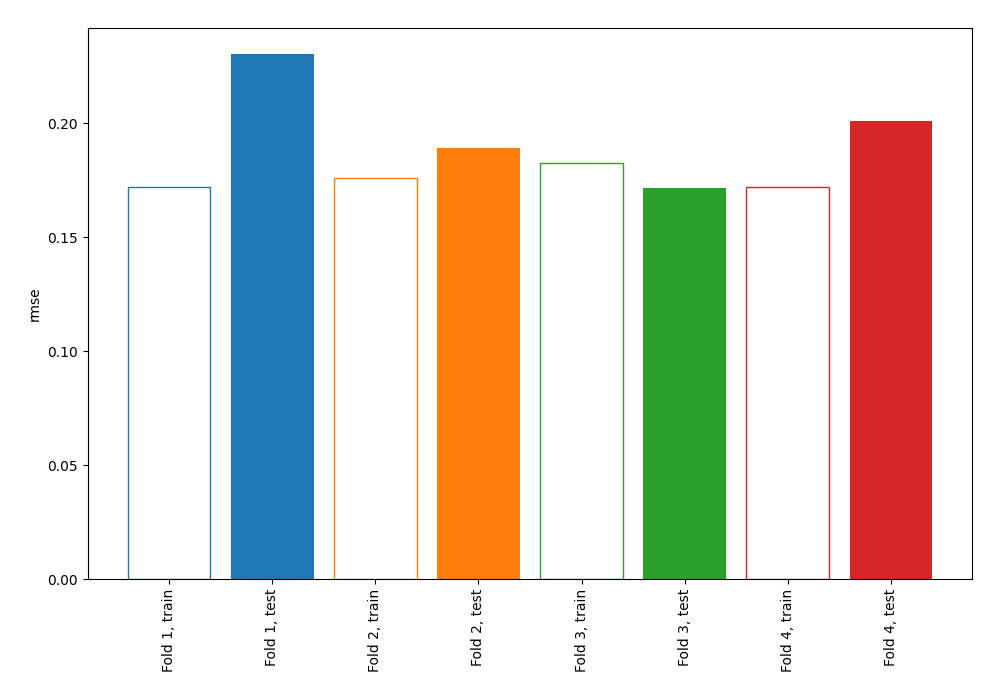
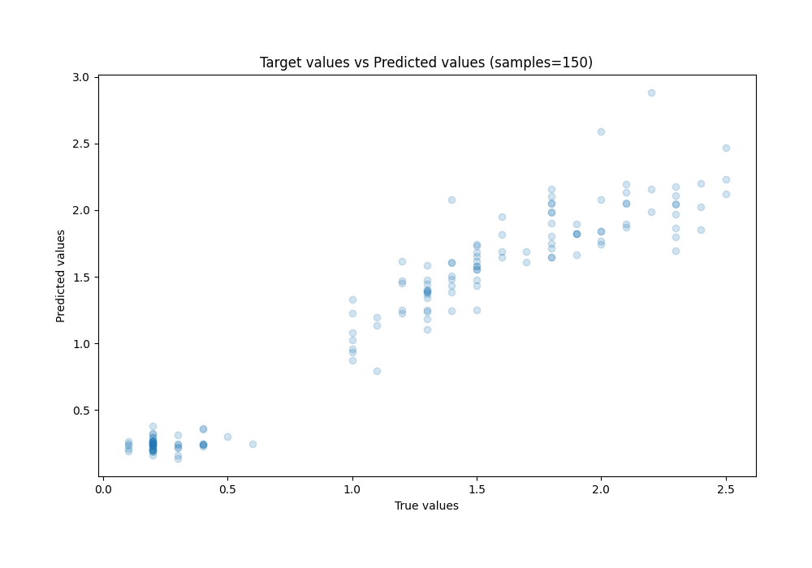
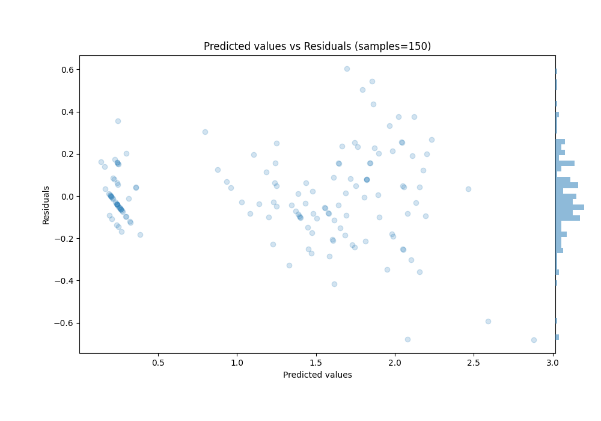

# Summary of 4_Linear_GoldenFeatures

[<< Go back](../README.md)

## Linear Regression (Linear)
- **n_jobs**: -1
- **explain_level**: 0

## Validation
 - **validation_type**: kfold
 - **k_folds**: 4
 - **shuffle**: True
 - **random_seed**: 123

## Optimized metric
rmse

## Training time

4.5 seconds

### Metric details:
| Metric   |     Score |
|:---------|----------:|
| MAE      | 0.146454  |
| MSE      | 0.0397064 |
| RMSE     | 0.199265  |
| R2       | 0.931201  |
| MAPE     | 0.197982  |

## Learning curves

## True vs Predicted

## Predicted vs Residuals

[<< Go back](../README.md)
