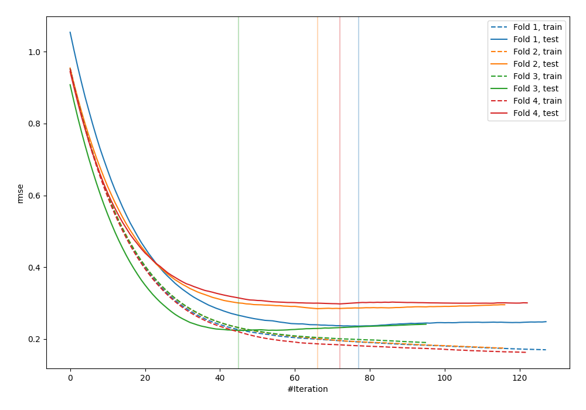
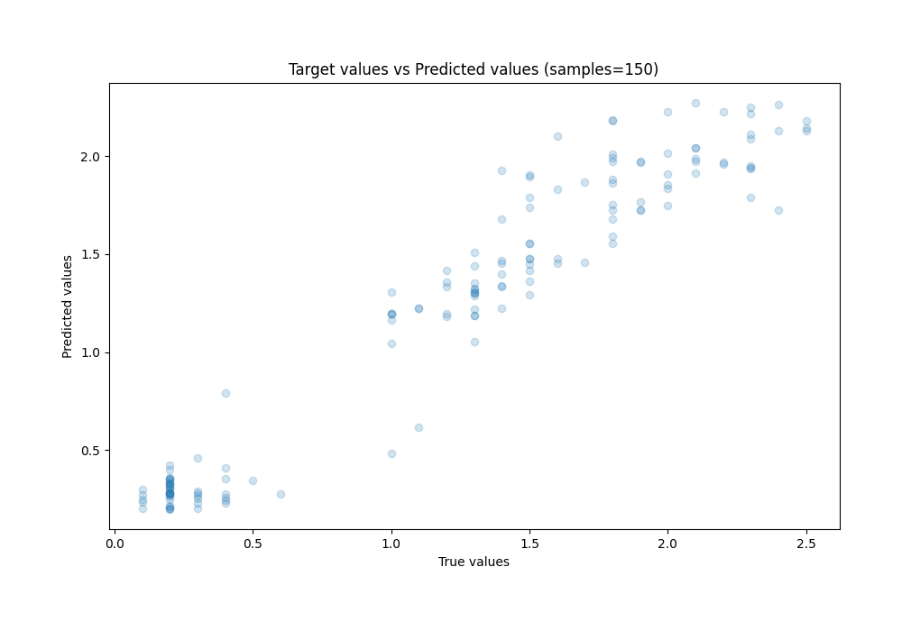
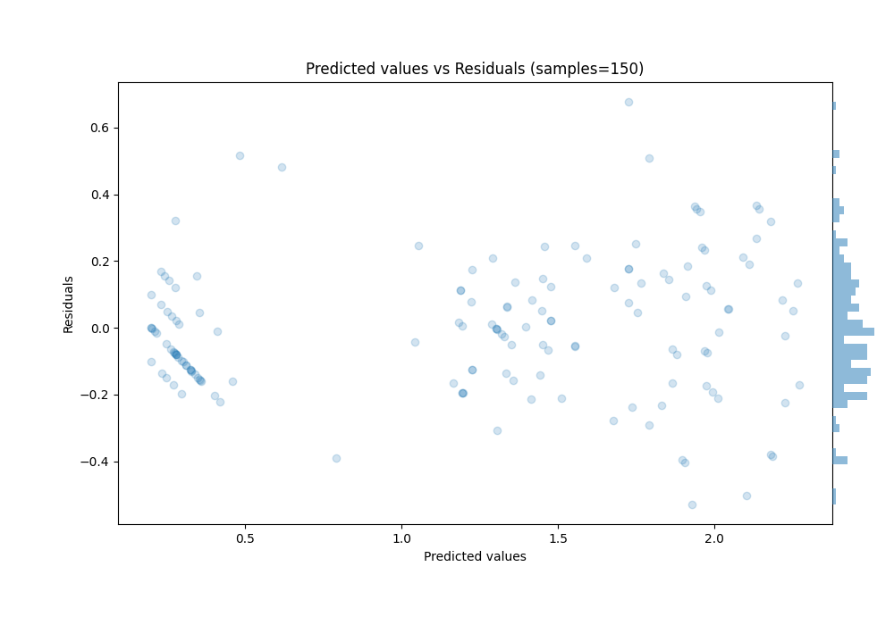

# Summary of 65_LightGBM

[<< Go back](../README.md)

## LightGBM
- **n_jobs**: -1
- **objective**: regression
- **num_leaves**: 31
- **learning_rate**: 0.05
- **feature_fraction**: 0.9
- **bagging_fraction**: 0.9
- **min_data_in_leaf**: 10
- **metric**: rmse
- **custom_eval_metric_name**: None
- **explain_level**: 0

## Validation
 - **validation_type**: kfold
 - **k_folds**: 4
 - **shuffle**: True
 - **random_seed**: 123

## Optimized metric
rmse

## Training time

1.0 seconds

### Metric details:
| Metric   |     Score |
|:---------|----------:|
| MAE      | 0.154503  |
| MSE      | 0.0396472 |
| RMSE     | 0.199116  |
| R2       | 0.931303  |
| MAPE     | 0.249298  |

## Learning curves

## True vs Predicted

## Predicted vs Residuals

[<< Go back](../README.md)
