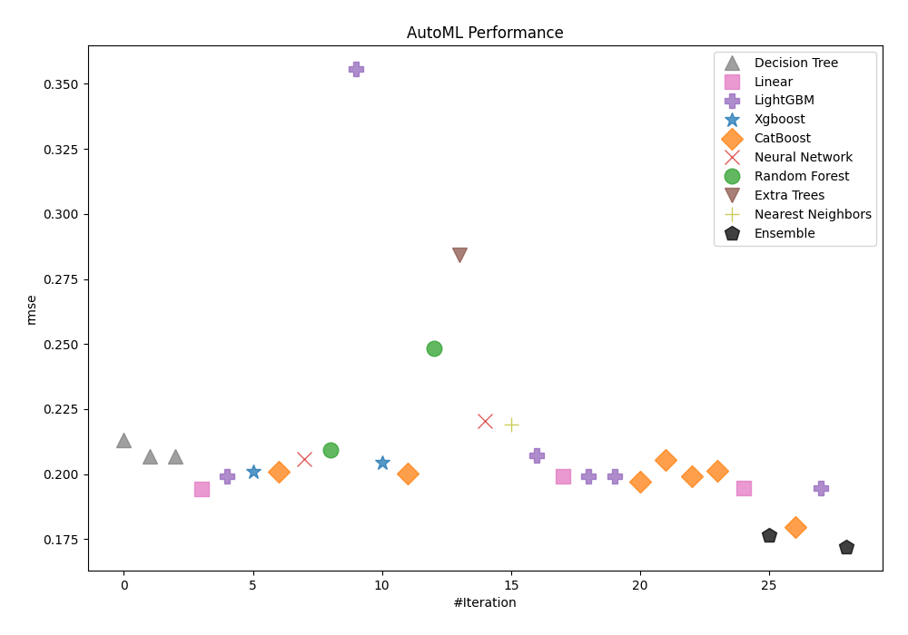
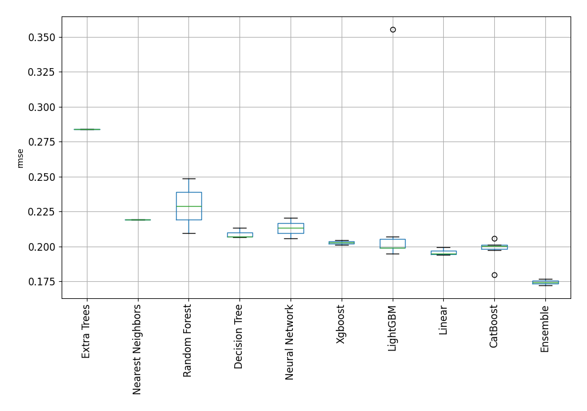
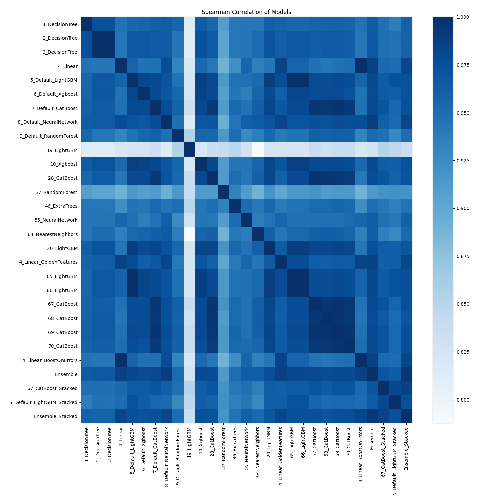

# AutoML Leaderboard

| Best model   | name                                                               | model_type        | metric_type   |   metric_value |   train_time |
|:-------------|:-------------------------------------------------------------------|:------------------|:--------------|---------------:|-------------:|
|              | [1_DecisionTree](1_DecisionTree/README.md)                         | Decision Tree     | rmse          |       0.213154 |         0.91 |
|              | [2_DecisionTree](2_DecisionTree/README.md)                         | Decision Tree     | rmse          |       0.206743 |         0.9  |
|              | [3_DecisionTree](3_DecisionTree/README.md)                         | Decision Tree     | rmse          |       0.206902 |         0.88 |
|              | [4_Linear](4_Linear/README.md)                                     | Linear            | rmse          |       0.194117 |         0.99 |
|              | [5_Default_LightGBM](5_Default_LightGBM/README.md)                 | LightGBM          | rmse          |       0.199116 |         1.17 |
|              | [6_Default_Xgboost](6_Default_Xgboost/README.md)                   | Xgboost           | rmse          |       0.201006 |         1.44 |
|              | [7_Default_CatBoost](7_Default_CatBoost/README.md)                 | CatBoost          | rmse          |       0.200783 |         1.9  |
|              | [8_Default_NeuralNetwork](8_Default_NeuralNetwork/README.md)       | Neural Network    | rmse          |       0.205753 |         1.15 |
|              | [9_Default_RandomForest](9_Default_RandomForest/README.md)         | Random Forest     | rmse          |       0.209363 |         2.28 |
|              | [19_LightGBM](19_LightGBM/README.md)                               | LightGBM          | rmse          |       0.355576 |         2.89 |
|              | [10_Xgboost](10_Xgboost/README.md)                                 | Xgboost           | rmse          |       0.204284 |         1.32 |
|              | [28_CatBoost](28_CatBoost/README.md)                               | CatBoost          | rmse          |       0.200345 |         2.03 |
|              | [37_RandomForest](37_RandomForest/README.md)                       | Random Forest     | rmse          |       0.248499 |         2.27 |
|              | [46_ExtraTrees](46_ExtraTrees/README.md)                           | Extra Trees       | rmse          |       0.28408  |         2.64 |
|              | [55_NeuralNetwork](55_NeuralNetwork/README.md)                     | Neural Network    | rmse          |       0.220389 |         1.23 |
|              | [64_NearestNeighbors](64_NearestNeighbors/README.md)               | Nearest Neighbors | rmse          |       0.219168 |         1.17 |
|              | [20_LightGBM](20_LightGBM/README.md)                               | LightGBM          | rmse          |       0.207061 |         1.25 |
|              | [4_Linear_GoldenFeatures](4_Linear_GoldenFeatures/README.md)       | Linear            | rmse          |       0.199265 |         4.75 |
|              | [65_LightGBM](65_LightGBM/README.md)                               | LightGBM          | rmse          |       0.199116 |         1.28 |
|              | [66_LightGBM](66_LightGBM/README.md)                               | LightGBM          | rmse          |       0.199116 |         1.29 |
|              | [67_CatBoost](67_CatBoost/README.md)                               | CatBoost          | rmse          |       0.197219 |         1.85 |
|              | [68_CatBoost](68_CatBoost/README.md)                               | CatBoost          | rmse          |       0.205597 |         2.52 |
|              | [69_CatBoost](69_CatBoost/README.md)                               | CatBoost          | rmse          |       0.199126 |         2.42 |
|              | [70_CatBoost](70_CatBoost/README.md)                               | CatBoost          | rmse          |       0.201097 |         1.82 |
|              | [4_Linear_BoostOnErrors](4_Linear_BoostOnErrors/README.md)         | Linear            | rmse          |       0.194595 |         1.26 |
|              | [Ensemble](Ensemble/README.md)                                     | Ensemble          | rmse          |       0.176571 |         1.03 |
|              | [67_CatBoost_Stacked](67_CatBoost_Stacked/README.md)               | CatBoost          | rmse          |       0.179577 |         3.47 |
|              | [5_Default_LightGBM_Stacked](5_Default_LightGBM_Stacked/README.md) | LightGBM          | rmse          |       0.194733 |         1.48 |
| **the best** | [Ensemble_Stacked](Ensemble_Stacked/README.md)                     | Ensemble          | rmse          |       0.172089 |         1.23 |

### AutoML Performance

### AutoML Performance Boxplot

### Spearman Correlation of Models

